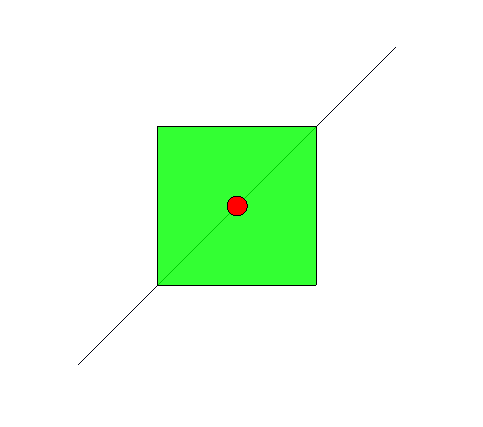

Geotools 是一个用于处理地理空间数据的开源 Java 库。它提供了一套功能丰富的工具和API，用于读取、写入、分析和操作地理信息系统（GIS）数据。
  
Geotools 是一个成熟且功能强大的 GIS 库，适用于各种地理空间数据处理和分析的应用场景，包括地图制作、空间数据管理、地理数据分析、位置智能等。它是一个开源项目，具有活跃的社区支持和广泛的用户基础。您可以访问 Geotools 的[官方网站](https://geotools.org "官方网站")
本文记录geotools的简单使用及sld样式读取。后续会有更多关于geotools内容。
<!--truncate-->

### 1. 依赖
geotools有很多依赖jar包，可以使用maven导入，也可以直接在官网下载。[官方下载地址](https://sourceforge.net/projects/geotools/files/ "官方下载地址")
直接下载官方包，压缩包内的lib就是需要的全部依赖，使用的时候将lib加入工程即可。

### 2. 代码示例
本文使用的geotools版本为14.5
```java
import com.vividsolutions.jts.geom.Geometry;
import com.vividsolutions.jts.io.ParseException;
import com.vividsolutions.jts.io.WKTReader;
import cyu.geotools.utils.SLDUtils;
import org.geotools.data.collection.ListFeatureCollection;
import org.geotools.data.simple.SimpleFeatureCollection;
import org.geotools.feature.simple.SimpleFeatureBuilder;
import org.geotools.feature.simple.SimpleFeatureTypeBuilder;
import org.geotools.map.FeatureLayer;
import org.geotools.map.Layer;
import org.geotools.map.MapContent;
import org.geotools.styling.Style;
import org.geotools.swing.JMapFrame;
import org.opengis.feature.simple.SimpleFeature;
import org.opengis.feature.simple.SimpleFeatureType;

import java.io.File;
import java.util.ArrayList;
import java.util.List;

public class HelloGeo {
    public static void main(String[] args) throws ParseException {
        String filed1 = "type";
        // 构建元素的type，其中包含 feature 的全部属性和图形属性
        SimpleFeatureTypeBuilder typeBuilder = new SimpleFeatureTypeBuilder();
        typeBuilder.setName("location");
        typeBuilder.add("geom", Geometry.class);
        typeBuilder.add(filed1, String.class);
        SimpleFeatureType type = typeBuilder.buildFeatureType();

        SimpleFeatureBuilder featureBuilder = new SimpleFeatureBuilder(type);
        // wkt数据格式读取器
        WKTReader wktReader = new WKTReader();
        List<SimpleFeature> features = new ArrayList<>();

        featureBuilder.set(filed1, "line");
        featureBuilder.set("geom", wktReader.read("LINESTRING (-2 -2, 2 2)"));
        features.add(featureBuilder.buildFeature("2"));

        featureBuilder.set(filed1, "polygon");
        featureBuilder.set("geom", wktReader.read("POLYGON ((-1 -1, 1 -1, 1 1, -1 1, -1 -1))"));
        features.add(featureBuilder.buildFeature("3"));

        featureBuilder.set(filed1, "point");
        featureBuilder.set("geom", wktReader.read("POINT (0 0)"));
        features.add(featureBuilder.buildFeature("1"));
        // 存储全部feature的集合
        SimpleFeatureCollection featureCollection = new ListFeatureCollection(type, features);
        // 最简单的sld样式,如果想要使地图更好看，需要复杂的样式，需要学习sld知识
        Style style = SLDUtils.getStyle(new File("src/atest/in/common.xml"));

        // 图层 包含数据集合 与 样式
        Layer layer2 = new FeatureLayer(featureCollection, style);
        // 地图内容，可以包含多个图层，可以出图。
        MapContent map = new MapContent();
        map.setTitle("画板显示");
        map.addLayer(layer2);
        // geotools官方提供的Java Swing程序，可以将上面结果显示出来
        JMapFrame.showMap(map);
    }
}
```

common.xml文件如下：
```xml
<?xml version="1.0" encoding="UTF-8"?>
<sld:StyledLayerDescriptor xmlns="http://www.opengis.net/sld" xmlns:sld="http://www.opengis.net/sld"
                           xmlns:gml="http://www.opengis.net/gml" xmlns:ogc="http://www.opengis.net/ogc"
                           version="1.0.0">
    <sld:NamedLayer>
        <sld:Name/>
        <sld:UserStyle>
            <sld:Name>Default Styler</sld:Name>
            <sld:FeatureTypeStyle>
                <sld:Name>name</sld:Name>
                <sld:Rule>
                    <ogc:Filter>
                        <ogc:PropertyIsEqualTo>
                            <ogc:PropertyName>type</ogc:PropertyName>
                            <ogc:Literal>point</ogc:Literal>
                        </ogc:PropertyIsEqualTo>
                    </ogc:Filter>
                    <sld:PointSymbolizer>
                        <sld:Graphic>
                            <sld:Mark>
                                <sld:WellKnownName>circle</sld:WellKnownName>
                                <sld:Fill>
                                    <sld:CssParameter name="fill">#FF0000</sld:CssParameter>
                                </sld:Fill>
                                <sld:Stroke/>
                            </sld:Mark>
                            <sld:Size>20.0</sld:Size>
                        </sld:Graphic>
                    </sld:PointSymbolizer>
                </sld:Rule>
                <sld:Rule>
                    <ogc:Filter>
                        <ogc:PropertyIsEqualTo>
                            <ogc:PropertyName>type</ogc:PropertyName>
                            <ogc:Literal>line</ogc:Literal>
                        </ogc:PropertyIsEqualTo>
                    </ogc:Filter>
                    <sld:LineSymbolizer>
                        <sld:Stroke>
                            <sld:CssParameter name="stroke">#000110</sld:CssParameter>
                        </sld:Stroke>
                    </sld:LineSymbolizer>
                </sld:Rule>
                <sld:Rule>
                    <ogc:Filter>
                        <ogc:PropertyIsEqualTo>
                            <ogc:PropertyName>type</ogc:PropertyName>
                            <ogc:Literal>polygon</ogc:Literal>
                        </ogc:PropertyIsEqualTo>
                    </ogc:Filter>
                    <sld:PolygonSymbolizer>
                        <sld:Fill>
                            <sld:CssParameter name="fill">#00FF00</sld:CssParameter>
                            <sld:CssParameter name="fill-opacity">0.8</sld:CssParameter>
                        </sld:Fill>
                        <sld:Stroke>
                            <sld:CssParameter name="stroke">#000000</sld:CssParameter>
                        </sld:Stroke>
                    </sld:PolygonSymbolizer>
                </sld:Rule>
            </sld:FeatureTypeStyle>
        </sld:UserStyle>
    </sld:NamedLayer>
</sld:StyledLayerDescriptor>
```

上面代码构建了一个最简单的geotools程序，使用了简单的样式绘制了点、线、面三种类型数据。  
使用geotools自带的GUI显示结果如下:  
<!-- [](https://geotools.org "去geotools官网看看") -->


### 3. 样式输出与读取
样式一般是写入xml文件中的，这样方便修改地图样式。
打印style对象，输出的就是sld文件内容：
  
```java
 public static void printSLD(Style style) {
    StyleFactory sf = CommonFactoryFinder.getStyleFactory();
    NamedLayer namedLayer = sf.createNamedLayer();
    namedLayer.addStyle(style);
    StyledLayerDescriptor sld = sf.createStyledLayerDescriptor();
    sld.layers().add(namedLayer);

    SLDTransformer sldTransformer = new SLDTransformer();
    try {
        String transform = sldTransformer.transform(sld);
        System.out.println(transform);
    } catch (TransformerException e) {
        e.printStackTrace();
    }
}
```
读取sld文件代码：
```java
public static Style getStyle(File sld) {
    StyleFactory styleFactory = CommonFactoryFinder.getStyleFactory();
    try {
        SLDParser sldParser = new SLDParser(styleFactory, sld);
        Style[] styles = sldParser.readXML();
        return styles[0];
    } catch (Exception e) {
        e.printStackTrace();
    }
    return null;
}
```