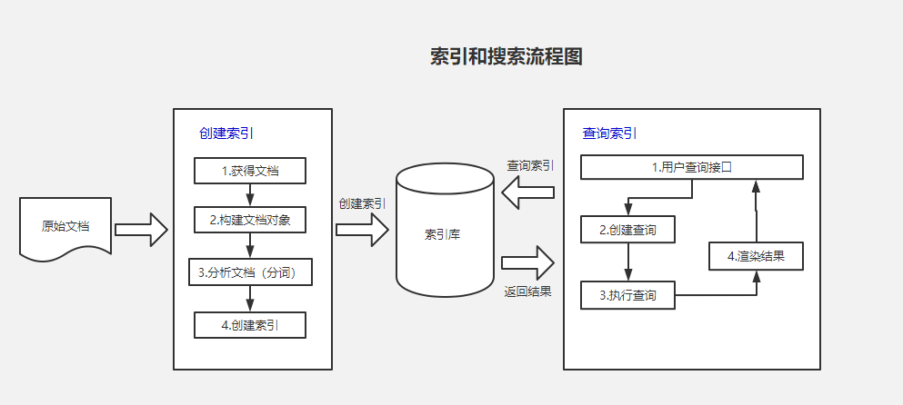

Lucene是一个开源的全文搜索引擎库，它提供了对文本内容进行索引和搜索的功能。


本文简单介绍lucene的使用。
<!--truncate-->
### 1. lucene介绍
Luene是一款高性能、可扩展的信息检索库，用于完成文档元信息、文档内容等搜索功能。用户可以使用Lucene 或 基于Lucene的成熟产品Nutch/Solr/Elasticsearch等来快速构建搜索服务，如文件搜索、网页搜索等。


Lucene仅仅是一个Java类库，对于线上大规模使用，除了需要经过封装开发形成产品外，还需要考虑可靠性、分布式化等问题。因此出现了基于Lucene的产品化系统，例如Nutch、Solr、Elasticsearch等。学校lucene可以更好理解es的工作原理。

### 2. 原理介绍



lucene是由索引和搜索两个过程，包含了创建索引，索引库和搜索三个要点。

查询前会先将查询的内容提取出来组成文档（正文）， 对文档进行切分词组成索引（目录）， 索引和文档有关联关系，查询的时候先查询索引，通过索引找文档。被用来存储在全文搜索下某个单词在一个文档或者一组文档中的存储位置的映射，Lucene会对文档进行倒排索引。

### 3. 常用术语
1. Index（索引）
索引，由很多的Document组成。类似数据库的表的概念，但又有很大不同。传统关系型数据库或者NoSQL数据库的表，在创建时要定义表的Scheme，定义表的主键或列等，有明确定义的约束。但是Lucene的Index完全没有约束。

2. Document（文档）
建立索引和查询的最小单位，由很多Field组成，类似数据库的记录或者文档数据库中文档的概念。写入Index的Document会被分配一个唯一的ID，即Sequence Number（更多被叫做DocId)。

3. Field（字段）
Lucene中数据索引的最小定义单位，由Field name,Field value和Field type组成，不同的Filed type（StringField、TextField、LongFiled或NumericDocValuesField）决定了不同的索引方式（Store Field，DocValues等等），也可以通过实现IndexableField接口来设置Field的属性。

4. Term 和 Term Dictionary
一个Field（主要指TextField的value）会由一个或多个Term组成。Term是由Field经过Analyzer（分词）产生，表示文本的一个词语。它有两个元素组成：词语的内容（查询时的关键字）和文本所在的域（即Field name）。这里需要与tocken区别开，Token是一个在分词过程中产生的对象，对应的Token对象包含了这个词语的自身内容，在这句话中的开始位置、结束位置以及一个可以储存其他信息的payload对象（Tocken在lucene2.9之后被Attuibutes接口实现类代替）。Term Dictionary即Term词典，lucene使用FST数据结构来存储term字典，lucene是根据Term词典来查询Term对应的文档ID。

5. Segment
一个Index会由一个或多个sub-index构成，sub-index被称为Segment。Lucene中的数据会先写入内存的一个Buffer（类似LSM的MemTable，但是不可读），当Buffer内数据达到一定量后会被flush成一个Segment，每个Segment有自己独立的索引，可独立被查询，但数据永远不能被更改。这种模式避免了随机写，数据写入都是Batch和Append，能达到很高的吞吐量。Segment中写入的文档不可被修改，但可被删除，删除的方式也不是在文件内部原地更改，而是会由另外一个文件保存需要被删除的文档的DocID，保证数据文件不可被修改。Index的查询需要对多个Segment进行查询并对结果进行合并，还需要处理被删除的文档，为了对查询进行优化，Lucene会有策略对多个Segment进行合并，这点与LSM对SSTable的Merge类似。

6. 反向索引
反向索引，即由单词->文档的索引，每个单词对应文档id列表，与正向索引相反（文档->单词，每个文档对应单词id列表）。在没有搜索引擎时，我们是直接输入一个网址，然后获取网站内容，这时我们的行为是：document -> to -> words。 通过文章，获取里面的单词，此谓「正向索引」，forward index。后来，我们希望能够输入一个单词，找到含有这个单词，或者和这个单词有关系的文章：word -> to -> documents，这就是反向索引，也译为倒排索引。

7. 分词器
分词器(Analyzer)的作用是把一段文本中的词按规则取出所包含的所有词，对应的是Analyzer类。在创建索引的时候需要用到分词器，在使用字符串搜索的时候也会用到分词器，并且这两个地方要使用同一个分词器，否则可能会搜索不出来结果。lucene自带的分词器对中文不太友好，
在Lucene中，有多个中文分词器可供选择，以下是其中几个常用的中文分词器：
- SmartChineseAnalyzer：这是Lucene内置的中文分词器之一。它采用了中文智能切分算法，能够根据语义和上下文进行词汇切分，提供较好的分词效果。SmartChineseAnalyzer支持多种分词模式，如最细粒度切分、搜索引擎切分和N-最短路径切分。

- IKAnalyzer：IKAnalyzer是一个第三方开源的中文分词器，也是Lucene生态系统中最流行的中文分词器之一。它具有良好的性能和准确性，并支持多种分词模式。IKAnalyzer还提供了自定义词典和停用词过滤等功能，使用户可以根据需求灵活地进行分词定制。
- Ansj分词器：Ansj是另一个常用的中文分词器，也是开源的。它基于NLP（自然语言处理）算法实现，具有较好的分词效果和性能。Ansj分词器支持细粒度切分和多种分词模式，并提供了丰富的扩展功能，如命名实体识别、关键词提取等。

- Jieba分词器：Jieba是一款流行的Python中文分词器，也有对应的Java版本可以与Lucene集成使用。它采用了基于Trie树的分词算法，能够快速切分中文文本。Jieba分词器具有良好的性能和准确度，并支持用户自定义词典和停用词过滤等功能。

需要注意的是，选择合适的中文分词器取决于具体应用场景和需求。某些分词器可能更适用于特定的文本类型或领域，因此在使用中文分词器时，可以尝试不同的分词器来确定最适合自己应用的效果。同时，还可以结合自定义词典和其他分析器组件来进一步优化和定制分词效果。

### 4. 代码示例
#### 4.1 引入依赖
```html
<dependency>
	<groupId>org.apache.lucene</groupId>
	<artifactId>lucene-analyzers-smartcn</artifactId>
	<version>7.6.0</version>
</dependency>
<dependency>
	<groupId>org.apache.lucene</groupId>
	<artifactId>lucene-queryparser</artifactId>
	<version>7.6.0</version>
</dependency>
```

#### 4.2 创建索引
```java
public void createIndex() throws IOException {
	List<Content> list1 = new ArrayList<>();
	list1.add(new Content(null, "Java面向对象", "10", null, "Java面向对象从入门到精通,简单上手"));
	list1.add(new Content(null, "Java面向对象java", "10", null, "Java面向对象从入门到精通,简单上手"));
	list1.add(new Content(null, "Java面向编程", "15", null, "Java面向对象编程书籍"));
	list1.add(new Content(null, "JavaScript入门", "18", null, "JavaScript入门编程书籍"));
	list1.add(new Content(null, "深入理解Java编程", "13", null, "十三四天掌握Java基础"));
	list1.add(new Content(null, "从入门到放弃_Java", "20", null, "一门从入门到放弃的书籍"));
	list1.add(new Content(null, "Head First Java", "30", null, "《Head First Java》是一本完整地面向对象(object-oriented，OO)程序设计和Java的学习指导用书"));
	list1.add(new Content(null, "Java 核心技术：卷1 基础知识", "22", null, "全书共14章，包括Java基本的程序结构、对象与类、继承、接口与内部类、图形程序设计、事件处理、Swing用户界面组件"));
	list1.add(new Content(null, "Java 编程思想", "12", null, "本书赢得了全球程序员的广泛赞誉，即使是最晦涩的概念，在Bruce Eckel的文字亲和力和小而直接的编程示例面前也会化解于无形"));
	list1.add(new Content(null, "Java开发实战经典", "51", null, "本书是一本综合讲解Java核心技术的书籍，在书中使用大量的代码及案例进行知识点的分析与运用"));
	list1.add(new Content(null, "Effective Java", "10", null, "本书介绍了在Java编程中57条极具实用价值的经验规则，这些经验规则涵盖了大多数开发人员每天所面临的问题的解决方案"));
	list1.add(new Content(null, "分布式 Java 应用：基础与实践", "14", null, "本书介绍了编写分布式Java应用涉及的众多知识点，分为了基于Java实现网络通信、RPC;基于SOA实现大型分布式Java应用"));
	list1.add(new Content(null, "http权威指南", "11", null, "超文本传输协议(Hypertext Transfer Protocol，HTTP)是在万维网上进行通信时所使用的协议方案"));
	list1.add(new Content(null, "Spring", "15", null, "这是啥，还需要学习吗？Java程序员必备书籍"));
	list1.add(new Content(null, "深入理解 Java 虚拟机", "18", null, "作为一位Java程序员，你是否也曾经想深入理解Java虚拟机，但是却被它的复杂和深奥拒之门外"));
	list1.add(new Content(null, "springboot实战", "11", null, "完成对于springboot的理解，是每个Java程序员必备的姿势"));
	list1.add(new Content(null, "springmvc学习", "72", null, "springmvc学习指南"));
	list1.add(new Content(null, "vue入门到放弃", "20", null, "vue入门到放弃书籍信息"));
	list1.add(new Content(null, "vue入门到精通", "20", null, "vue入门到精通相关书籍信息"));
	list1.add(new Content(null, "vue之旅", "20", null, "由浅入深地全面介绍vue技术，包含大量案例与代码"));
	list1.add(new Content(null, "vue实战", "20", null, "以实战为导向，系统讲解如何使用 "));
	list1.add(new Content(null, "vue入门与实践", "20", null, "现已得到苹果、微软、谷歌等主流厂商全面支持"));
	list1.add(new Content(null, "Vue.js应用测试", "20", null, "Vue.js创始人尤雨溪鼎力推荐！Vue官方测试工具作者亲笔撰写，Vue.js应用测试完全学习指南"));
	list1.add(new Content(null, "PHP和MySQL Web开发", "20", null, "本书是利用PHP和MySQL构建数据库驱动的Web应用程序的权威指南"));
	list1.add(new Content(null, "Web高效编程与优化实践", "20", null, "从思想提升和内容修炼两个维度，围绕前端工程师必备的前端技术和编程基础"));
	list1.add(new Content(null, "Vue.js 2.x实践指南", "20", null, "本书旨在让初学者能够快速上手vue技术栈，并能够利用所学知识独立动手进行项目开发"));
	list1.add(new Content(null, "初始vue", "20", null, "解开vue的面纱"));
	list1.add(new Content(null, "什么是vue", "20", null, "一步一步的了解vue相关信息"));
	list1.add(new Content(null, "深入浅出vue", "20", null, "深入浅出vue，慢慢掌握"));
	list1.add(new Content(null, "三天vue实战", "20", null, "三天掌握vue开发"));
	list1.add(new Content(null, "不知火舞", "20", null, "不知名的vue"));
	list1.add(new Content(null, "娜可露露", "20", null, "一招秒人"));
	list1.add(new Content(null, "宫本武藏", "20", null, "我就是一个超级兵"));
	list1.add(new Content(null, "vue宫本vue", "20", null, "我就是一个超级兵"));
	list1.add(new Content(null, "城区", "20", null, "福建省泉州市鲤城区"));

	// 创建文档的集合
	List<Document> docs = new ArrayList<>();
	for (int i = 0; i < list1.size(); i++) {
		//contentMapper.insertSelective(list1.get(i));
		// 创建文档对象
		Document document = new Document();
		//StringField会创建索引，但是不会被分词，TextField，即创建索引又会被分词。
		document.add(new StringField("id", (i + 1) + "", Field.Store.YES));
		document.add(new TextField("title", list1.get(i).getTitle(), Field.Store.YES));
		document.add(new TextField("price", list1.get(i).getPrice(), Field.Store.YES));
		document.add(new TextField("descs", list1.get(i).getDescs(), Field.Store.YES));
		docs.add(document);
	}

	// 索引目录类,指定索引在硬盘中的位置，我的设置为D盘的indexDir文件夹
	Directory directory = FSDirectory.open(FileSystems.getDefault().getPath(searchPath));
	// 引入IK分词器
	Analyzer analyzer = new SmartChineseAnalyzer();
	// 索引写出工具的配置对象，这个地方就是最上面报错的问题解决方案
	IndexWriterConfig conf = new IndexWriterConfig(analyzer);
	// 设置打开方式：OpenMode.APPEND 会在索引库的基础上追加新索引。OpenMode.CREATE会先清空原来数据，再提交新的索引
	conf.setOpenMode(IndexWriterConfig.OpenMode.CREATE);
	// 创建索引的写出工具类。参数：索引的目录和配置信息
	IndexWriter indexWriter = new IndexWriter(directory, conf);
	// 把文档集合交给IndexWriter
	indexWriter.addDocuments(docs);
	// 提交
	indexWriter.commit();
	// 关闭
	indexWriter.close();
}
```

#### 4.3 搜索
```java
public List<Content> searchText(String keyword) throws IOException, ParseException {
	Directory directory = FSDirectory.open(FileSystems.getDefault().getPath(searchPath));
	// 索引读取工具
	IndexReader reader = DirectoryReader.open(directory);
	// 索引搜索工具
	IndexSearcher searcher = new IndexSearcher(reader);
	// 创建查询解析器,两个参数：默认要查询的字段的名称，分词器
	QueryParser parser = new QueryParser("descs", new SmartChineseAnalyzer());
	// 创建查询对象
	Query query = parser.parse(keyword);
	// 获取前十条记录
	TopDocs topDocs = searcher.search(query, 10);
	// 获取总条数
	System.out.println("本次搜索共找到" + topDocs.totalHits + "条数据");
	// 获取得分文档对象（ScoreDoc）数组.SocreDoc中包含：文档的编号、文档的得分
	ScoreDoc[] scoreDocs = topDocs.scoreDocs;
	List<Content> list = new ArrayList<>();
	for (ScoreDoc scoreDoc : scoreDocs) {
		// 取出文档编号
		int docID = scoreDoc.doc;
		// 根据编号去找文档
		Document doc = reader.document(docID);
		//Content content = contentMapper.selectByPrimaryKey(doc.get("id"));
		Content content = new Content();
		content.setId(Integer.valueOf(doc.get("id")));
		content.setTitle(doc.get("title"));
		content.setDescs(doc.get("descs"));
		list.add(content);
	}
	return list;
}
```

#### 4.4 删除索引
```java
public void deleteIndex() throws IOException {
	// 创建目录对象
	Directory directory = FSDirectory.open(FileSystems.getDefault().getPath(searchPath));
	// 创建配置对象
	IndexWriterConfig conf = new IndexWriterConfig(new SmartChineseAnalyzer());
	// 创建索引写出工具
	IndexWriter writer = new IndexWriter(directory, conf);
	// 根据词条进行删除
	writer.deleteAll();
	//        writer.deleteDocuments(new Term("id", "34"));
	// 提交
	writer.commit();
	// 关闭
	writer.close();
}
```