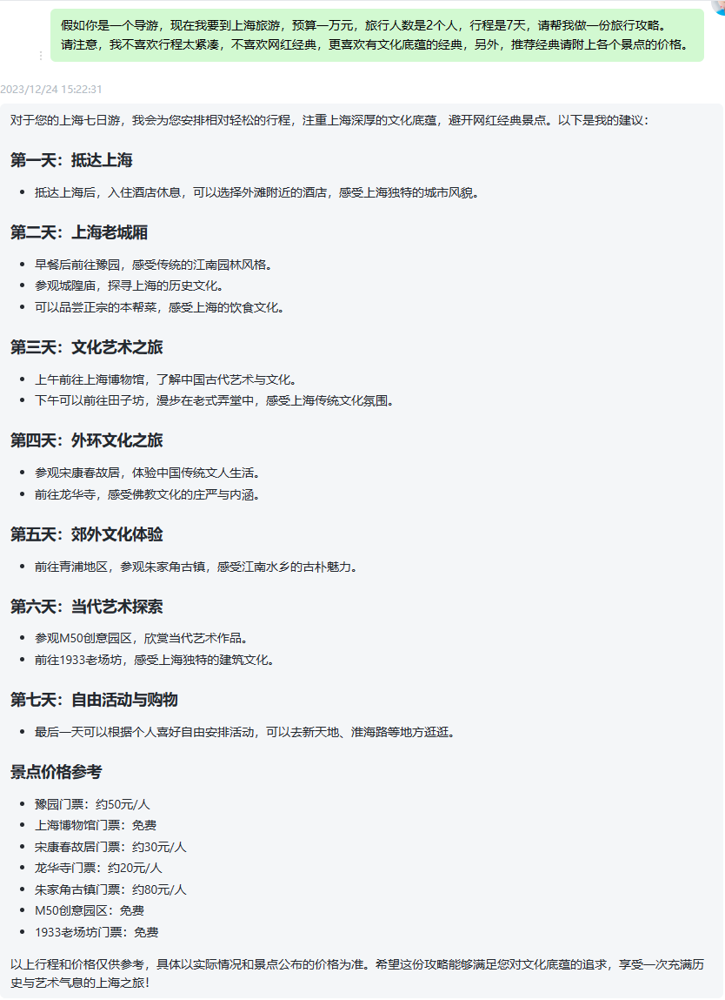

关于 GPT 的基本面介绍，以及怎么注册，这些搜索引擎一搜一大把的东西，这里不浪费过多口舌。

文末会有国内免费使用的chatgpt分享，请注意查看!
<!--truncate-->
### 应用领域
- 对话聊天：作为一个基于自然语言处理的模型，ChatGPT可以与用户进行流畅、自然的对话，提供实时的智能问答功能。这种应用在客户服务、智能助手和聊天机器人等领域具有很高的价值。ChatGPT可以作为智能客服助手，处理用户咨询和问题，提供实时、准确的回答。它可以降低人工客服的负担，提高客户满意度。
- 编写文章：ChatGPT具备强大的文本生成能力，可以根据给定的主题、关键词或开头，自动生成结构合理、内容丰富的文章。这一功能可广泛应用于新闻撰写、博客创作、营销宣传等内容创作领域。
- 语言翻译：ChatGPT可以进行语言之间的翻译工作，帮助人们消除语言障碍，促进跨文化交流。
- 编程帮助：ChatGPT可以理解和生成编程语言，为程序员提供实时的编程帮助。例如，它可以解答代码相关的问题、提供代码示例，甚至帮助检查和调试程序。

这些仅仅是ChatGPT主要用途的很少一部分，随着技术的不断进步，它在未来还可能拓展至更多领域和场景。

### 如何使用
很多人拿到 GPT 后的第一个感觉就是：**文不对题**。也就是说，你经常会感觉到 ChatGPT 回答的好空，没有太多参考价值......

事实上，GPT 几乎可以胜任工作和学习上的大部分问题，大幅度提高使用者的工作和学习效率。

变成了一个私人助理，渗透了工作、学习、生活的方方面面....

其实整个AI使用的核心心法，用一句话就可以概括了：

**GPT 生成的答案质量，完全取决于你『问它』，以及『引导它』的方式，如果你能问得好，引导的好，那么它就会帮你生成让你惊喜的答案，反之则无价值，假大空。**

如果你给AI的提示词质量不好，或者不到位，那么 AI 给到你的，往往就是那种 “像是一堆正确的废话堆积而成” 的文字垃圾。

**该如何写出高质量的提示词呢？**

一个好的提示词是由：**立角色** + **述问题** + **定目标** + **补要求**，这四部分构成的！！
1. **立角色** ：引导AI进入具体场景，为 AI 赋予行家身份。
2. **述问题** ：告诉AI你的困惑，你的问题，以及为AI补充问题所需要的背景信息。
3. **定目标**：告诉AI你的需求，你希望它为你做到什么。
4. **补要求**：告诉AI，它的回答需要注意什么，或者你想让它以什么形式来回复你。

例如：假如你是一个导游，现在我要到上海旅游，预算一万元，旅行人数是2个人，行程是7天，请帮我做一份旅行攻略。 
请注意，我不喜欢行程太紧凑，不喜欢网红经典，更喜欢有文化底蕴的经典，另外，推荐经典请附上各个景点的价格。

加角色和没加角色，GPT的答案差异非常大。

那么还有哪些方式可以给 GPT 加上这个 Buff 呢？  
以下这几个提示词都可以~
> 你现在是[xx]  
请你扮演[XX]  
假如你是 [XX]  
请你以 [XX] 的角度/身份/语气.....

### 最后寄语
最后，分享一个国内可以免费使用的 GPT , [地址](/gpt "地址")  
另外，该地址不稳定勿分享，自己使用即可。  
如果该地址失效，可以关注wxh，然后回复GPT获取最新地址。

欢迎关注，不定期更新新的知识和资源。

感谢您的支持！！