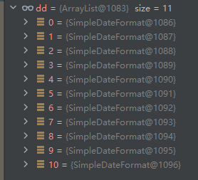

SimpleDateFormat是否线程安全，工具类中提供的时间格式化工具经常用到SimpleDateFormat来格式化Date，那么是否线程安全。
<!--truncate-->
### 分析
SimpleDateFormat是线程不安全的，如果多个线程使用同意给SimpleDateFormat对象去格式化Date，格式化时calendar设置时间，可能会互相干扰从而得到不正确的结果。  

查看源码，发现格式化Date过程如下
```java
// Called from Format after creating a FieldDelegate
private StringBuffer format(Date date, StringBuffer toAppendTo,
                            FieldDelegate delegate) {
    // Convert input date to time field list
    calendar.setTime(date);
    ...
```
使用了 Calendar 类变量去设置date，再去格式化。所以多线程使用同一个对象去格式化肯定会出现线程安全问题。

### 代码验证
```java
private final SimpleDateFormat simpleDateFormat = new SimpleDateFormat("yyyyMMdd HHmm");
@Test
public void testDateFormat() {
    for (int i = 0; i < 11; i++) {
        String no = i + "";
        long time = System.currentTimeMillis() - i * 1000 * 60;
        new Thread(() -> {
            String format = simpleDateFormat.format(new Date(time));
            System.out.println(no + ":" + format);
        }).start();
    }
}
```
使用11个线程 去打印过去11分钟的时间字符串，如果线程安全，应该正常打印没有重复时间字符串。  
真实结果如下：
```
10:20231029 1943
3:20231029 1944
6:20231029 1944
1:20231029 1944
5:20231029 1943
0:20231029 1943
2:20231029 1944
9:20231029 1943
8:20231029 1944
4:20231029 1944
7:20231029 1943
```
说明是不安全的。

### 如何安全使用
可以使用 ThreadLocal。  
对于某些线程不安全的类、或者资源，可以用ThreadLocal，然后每个线程都会使用自己线程副本中存储的对象，从而保证安全性。
```java
private static final ThreadLocal<SimpleDateFormat> dateFormat = ThreadLocal.withInitial(() -> new SimpleDateFormat("yyyyMMdd HHmm"));
@Test
public void testExecutor() throws InterruptedException {
    for (int i = 0; i < 11; i++) {
        String no = i + "";
        long time = System.currentTimeMillis() - i * 1000 * 60;
        new Thread(() -> {
            SimpleDateFormat simpleDateFormat = dateFormat.get();
            String format = simpleDateFormat.format(new Date(time));
            System.out.println(no + ":" + format);
            dd.add(simpleDateFormat);
            // dateFormat.remove();
        }).start();
    }
    Thread.sleep(3000);
    System.out.println();
}
```
每个线程格式化时，先从 ThreadLocal 中获取自己线程的格式化器。从而使用各自的格式化器去格式化时间。  
结果如下，没有重复，如果是安全的。
```
1:20231029 2009
2:20231029 2008
4:20231029 2006
0:20231029 2010
5:20231029 2005
3:20231029 2007
7:20231029 2003
10:20231029 2000
6:20231029 2004
8:20231029 2002
9:20231029 2001
```

每个线程对应的SimpleDateFormat，可以看到都是不一样的。


### ThreadLocal 内存泄露问题是怎么导致的？
`ThreadLocalMap` 中使用的 key 为 `ThreadLocal` 的弱引用，而 value 是强引用。  
所以，如果 `ThreadLocal` 没有被外部强引用的情况下，在垃圾回收的时候，key 会被清理掉，而 value 不会被清理掉。
这样一来，`ThreadLocalMap` 中就会出现 key 为 null 的 Entry。  
假如我们不做任何措施的话，value 永远无法被 GC 回收，这个时候就可能会产生内存泄露。

当一个线程结束后，如果没有手动清理 ThreadLocal 对象中的值，那么这些值就会变成垃圾数据。然而，由于 ThreadLocal 对象是被线程持有的，而线程一般是由线程池或者其他长生命周期的对象管理的，因此 ThreadLocal 对象也会被一直持有，从而导致内存泄露。  
为了解决 ThreadLocal 内存泄露问题，我们可以在使用完 ThreadLocal 后 **手动调用 remove() 方法** 来清理线程局部变量。这样可以确保在线程结束后及时清理掉 ThreadLocal 对象中的值，避免内存泄露的发生。