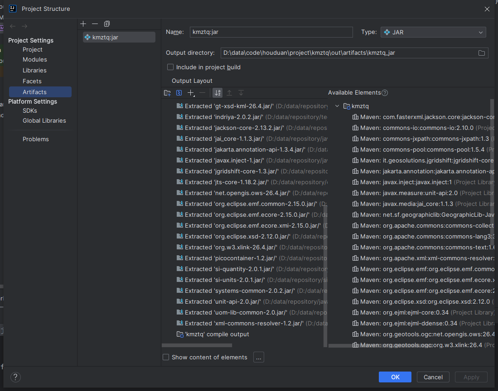
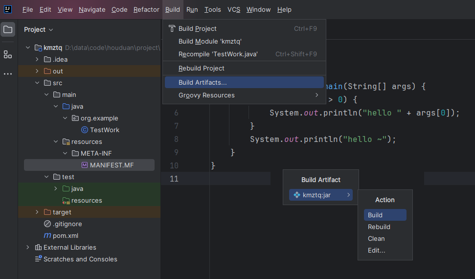
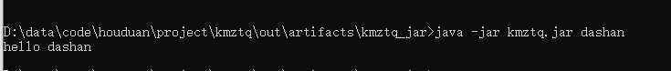
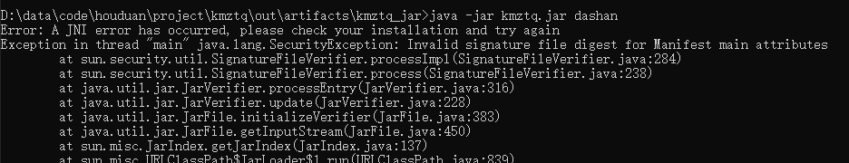
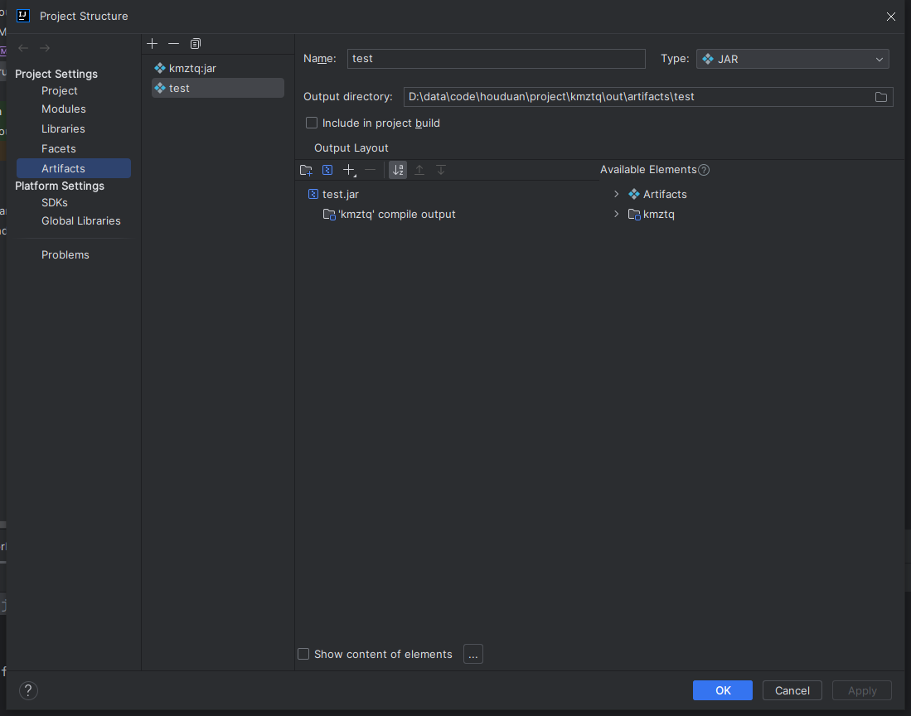
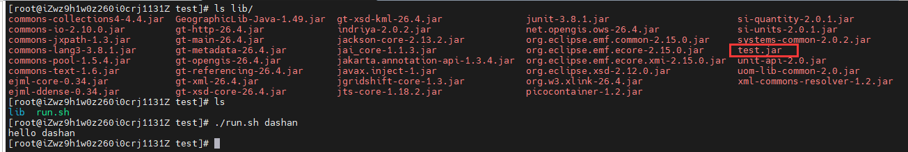

对于非spring的普通java项目，如何打jar包运行？

记录两种打包运行方式。
<!--truncate-->
有时候需要写一些小工具、或者非spring、非maven的java项目，一般都是小需求，只要提供一个jar给别人使用，这样比较方便，不需要引入过多的依赖。
 
### 1. 全量包
如果依赖较少，可以采用直接把依赖一起打进jar包里面，这样输出结果只有一个jar，这样可以很方便的提供给需要的人，不需要额外的处理。



可以在创建artifacts时，选择主类，也可以在 **MANIFEST.MF** 中指定主类。
```test title='MANIFEST.MF' icon='logos:text'
Manifest-Version: 1.0
Main-Class: org.example.TestWork

```



然后就可以运行了。


:::tip
有时候会遇到一些错误，原因是有一些依赖的文件加入后，会对jar运行机制产生影响，具体原因还不清楚。

如：Invalid signature file digest for Manifest main attributes
或者 Could not find or load main class com.xx.xxx

这时要删除一些文件，或者在maven配置中排除一些文件。主要是
- xxx.SF
- xxx.DSA
:::

### 2. 非全量包
如果依赖较多，用第一种方式打出来的包可能很大，不利于修改和传递。可以打非全量的包。

只把项目的代码打成jar包，把依赖包放在其他目录，运行时可以设置依赖路径。

因为依赖包是不会经常变的，所以不需要一起传给对方，只需要提供项目代码的jar，直接替换就可以了。

可以利用idea将所有依赖导出。  
导出时，只需要选择项目代码。


打包后将依赖和代码jar一起部署到环境。

选择一个目录，在目录下创建lib目录用于存放所有jar，然后写一个运行脚本，运行脚本如下：
```shell title='run.sh' icon='logos:shell'
#!/bin/bash

LIB=/data/test
CLASSPATH=
for jar in $LIB/lib/*.jar; do
    CLASSPATH=$CLASSPATH:$jar
done
java -Xms512m -Xmx1024m -classpath $CLASSPATH  org.example.TestWork  $1 $2
```

然后赋权后直接运行 `./run.sh`


这种方式打出的test.jar很小，里面只有我们自己的代码，可以很方便的替换到环境上面。

### 总结
上面是我用到的两种打jar包方式。