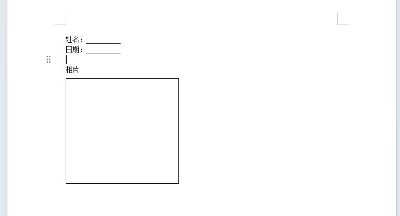
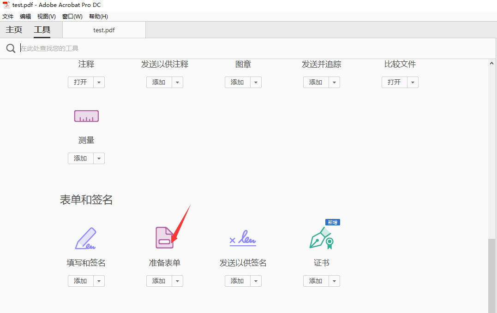
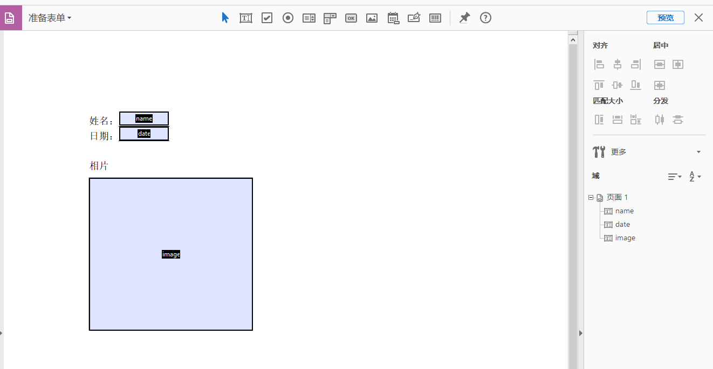

项目中遇到需要导出PDF的需求，记录使用 itextpdf 导出pdf。
<!--truncate-->
工作中经常遇到需要将数据导出文件的需求，一般导出csv这种比较简单。这次遇到需要导出成PDF，这就比较麻烦了，使用 itextpdf 可以解决这个需求。

itextpdf可以直接输出PDF，也可以按照PDF模板填充字段。

### 创建模板
创建PDF模板，需要使用 Adobe Acrobat DC，该软件可以自行百度安装即可。

1. 在word中画好模板，另存为PDF格式。


2. 打开 Adobe Acrobat DC，选择工具-准备表单，选择刚刚导出的PDF。


3. 编辑表单字段。保存为模板。


### 代码填充
maven依赖
```
<dependencies>
    <!-- PDF工具类 -->
    <dependency>
        <groupId>com.itextpdf</groupId>
        <artifactId>itextpdf</artifactId>
        <version>5.5.13</version>
    </dependency>
    <!-- PDF中文支持 -->
    <dependency>
        <groupId>com.itextpdf</groupId>
        <artifactId>itext-asian</artifactId>
        <version>5.2.0</version>
    </dependency>
</dependencies>
```

java填充
```java
public static void main(String[] args) throws Exception {
    String name = "大聪明";
    String date = "2024-01-20";
    String imagePath = "D:\\test.PNG";
    outPdf(name, date, imagePath);
}

public static void outPdf(String name, String date, String imagePath) throws Exception {
    String templatePath = "d:\\test1.pdf";
    String outPdf = "d:\\out.pdf";

    BaseFont bfChinese = BaseFont.createFont("STSong-Light", "UniGB-UCS2-H", BaseFont.NOT_EMBEDDED);

    try (FileOutputStream out = new FileOutputStream(outPdf);
            ByteArrayOutputStream bos = new ByteArrayOutputStream()){
        PdfReader reader = new PdfReader(templatePath);
        PdfStamper stamper = new PdfStamper(reader, bos);
        AcroFields form = stamper.getAcroFields();
        form.addSubstitutionFont(bfChinese);
        form.setField("name", name);
        form.setField("date", date);

        //图片类的内容处理
        String imagekey = "image";
        int pageNo = form.getFieldPositions(imagekey).get(0).page;
        Rectangle signRect = form.getFieldPositions(imagekey).get(0).position;
        float x = signRect.getLeft();
        float y = signRect.getBottom();
        //根据路径读取图片
        Image image = Image.getInstance(imagePath);
        //获取图片页面
        PdfContentByte under = stamper.getOverContent(pageNo);
        //图片大小自适应
        image.scaleToFit(signRect.getWidth(), signRect.getHeight());
        //添加图片
        image.setAbsolutePosition(x, y);
        under.addImage(image);
        // 如果为false，生成的PDF文件可以编辑，如果为true，生成的PDF文件不可以编辑
        stamper.setFormFlattening(true);
        stamper.close();

        Document doc = new Document();
        PdfCopy copy = new PdfCopy(doc, out);
        doc.open();
        PdfImportedPage importPage = copy.getImportedPage(new PdfReader(bos.toByteArray()), 1);
        copy.addPage(importPage);
        doc.close();
    }

}
```

### 运行结果


### 总结
从上面的过程来看，还是很简单的。虽然只有3个填充，但是已经打通了Java导出PDF的流程。

在实际开发中，肯定不止这几个简单字段，但是只要知道了基本操作，不管模板多复杂，填充不同类型的字段代码也可以参考，也就可以导出任意要求的PDF。