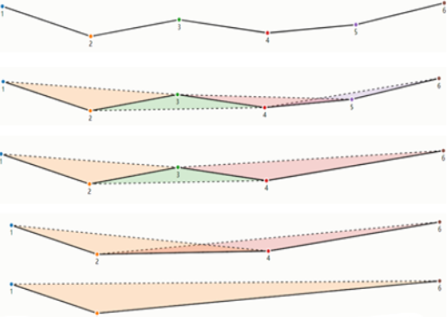
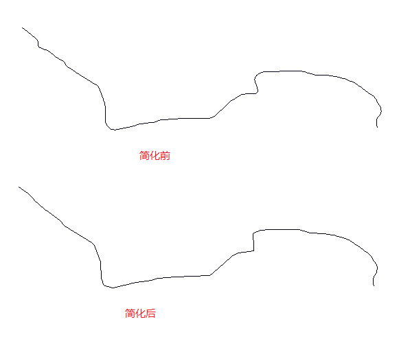
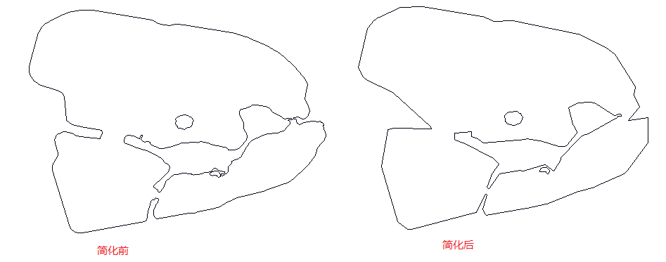

项目中遇到需要简化图形的需求，本文记录使用Visvalingam-Whyatt算法抽稀图形。
<!--truncate-->
一个多边形或者线段，有许多点构成，一个省的边界线可能有几十万个点构成，不利于存储和传输。有时候不需要那么高的精细度，只需要保持最基本的图形轮廓即可。这就需要进行图形简化。

### Visvalingam-Whyatt简介
Visvalingam-Whyatt算法是一种用于点数据简化的技术。

为了确保删除的节点引起的可视变化最小，算法计算了一条折线的每个节点与前后两个节点所组成的三角形的面积集合。当集合中最小的三角形面积小于设定阈值的时候，该面积对应的节点才会被标记删除；  
删除上一步中标记删除的节点，再重复上一步的过程，直到每个三角形的面积都大于阈值。


算法简化后的图形产生的角度变化更少，更能保留几何面的特征，适用于自然要素的概化，例如河流、森林边界、海岸线等。

Visvalingam-Whyatt的时间复杂度是O(nlog(n))。

### 主要代码
使用的geotools版本为14.5，高版本有一些不同。
```java
public class VisvalingamWhyattTest {
    private GeometryFactory factory = JTSFactoryFinder.getGeometryFactory();

    private double triangleArea(Coordinate a, Coordinate b, Coordinate c) {
        return Math.abs((a.x * (b.y - c.y) + b.x * (c.y - a.y) + c.x * (a.y - b.y)) / 2);
    }

    /**
     * 简化接口
     * @param geometry 传入多边形有Polygon，MultiPolygon，LineString，MultiLineString多种类型
     * @param limit limit是去掉点的百分比，粗略值
     * @return 简化后的图形
     */
    public Geometry simplifyGeometry(Geometry geometry, double limit) {
        if (limit < 0 || limit > 1) limit = 0.3;
        if (geometry instanceof Polygon) {
            return simplifyPolygon((Polygon) geometry, limit);
        } else if (geometry instanceof LineString) {
            return simplifyLine((LineString) geometry, limit);
        } else if (geometry instanceof MultiPolygon) {
            List<Polygon> polygonList = new ArrayList<>();
            MultiPolygon multiPolygon = (MultiPolygon) geometry;
            int numGeometries = multiPolygon.getNumGeometries();
            for (int i = 0; i < numGeometries; i++) {
                Geometry geometryN = multiPolygon.getGeometryN(i);
                Geometry geometry1 = simplifyGeometry(geometryN, limit);
                if (geometry1 instanceof Polygon) {
                    polygonList.add((Polygon) geometry1);
                }
            }
            return factory.createMultiPolygon(polygonList.toArray(new Polygon[0]));
        } else if (geometry instanceof MultiLineString) {
            List<LineString> lineStringList = new ArrayList<>();
            MultiLineString multiLineString = (MultiLineString) geometry;
            int numGeometries = multiLineString.getNumGeometries();
            for (int i = 0; i < numGeometries; i++) {
                Geometry geometryN = multiLineString.getGeometryN(i);
                Geometry geometry1 = simplifyGeometry(geometryN, limit);
                if (geometry1 instanceof LineString) {
                    lineStringList.add((LineString) geometry1);
                }
            }
            return factory.createMultiLineString(lineStringList.toArray(new LineString[0]));
        }
        return geometry;
    }

    public Geometry simplifyPolygon(Polygon polygon, double limit) {
        LinearRing exteriorRing = (LinearRing) polygon.getExteriorRing();
        LinearRing linearRing = simplifyRing(exteriorRing, limit);
        int numInteriorRing = polygon.getNumInteriorRing();
        List<LinearRing> linearRings = new ArrayList<>();
        if (numInteriorRing != 0) {
            for (int i = 0; i < numInteriorRing; i++) {
                LinearRing interiorRingN =(LinearRing) polygon.getInteriorRingN(i);
                LinearRing interiorRing = simplifyRing(interiorRingN, limit);
                linearRings.add(interiorRing);
            }
        }
        try {
            return factory.createPolygon(linearRing, linearRings.isEmpty() ? null : linearRings.toArray(new LinearRing[0]));
        } catch (Exception e) {
            e.printStackTrace();
        }
        return polygon;
    }

    private LinearRing simplifyRing(LinearRing linearRing, double limit) {
        Coordinate[] points = linearRing.getCoordinates();
        int length = points.length;
        if (length < 5) return linearRing;
        double[] areas = new double[length];
        for (int i = 1; i < length - 1; i++) {
            areas[i] = triangleArea(points[i - 1], points[i], points[i + 1]);
        }
        double limitArea = getLimitArea(length, limit, areas);
        List<Coordinate> coordinates = optimizePath(points, areas, limitArea);
        if (coordinates.size() < 4) return linearRing;
        try {
            return factory.createLinearRing(coordinates.toArray(new Coordinate[0]));
        } catch (Exception e) {
            e.printStackTrace();
        }
        return linearRing;
    }

    public Geometry simplifyLine(LineString lineString, double limit) {
        if (limit > 1 || limit < 0) {
            limit = 0.3;
        }
        Coordinate[] points = lineString.getCoordinates();
        int length = points.length;
        if (length < 5) return lineString;
        double[] areas = new double[length];
        for (int i = 1; i < length - 1; i++) {
            areas[i] = triangleArea(points[i - 1], points[i], points[i + 1]);
        }
        double limitArea = getLimitArea(length, limit, areas);
        List<Coordinate> coordinates = optimizePath(points, areas, limitArea);
        return factory.createLineString(coordinates.toArray(new Coordinate[0]));
    }

    private double getLimitArea(int length, double limit, double[] areas) {
        List<Double> areaList = Arrays.stream(areas).boxed().sorted().collect(Collectors.toList());
        int index = Double.valueOf(length * limit).intValue();
        double limitArea = 0;
        for (int i = index; i < length; i++) {
            double area = areaList.get(i);
            if (Double.compare(area, 0) != 0) {
                limitArea = area;
                break;
            }
        }
        return limitArea;
    }

    // Visvalingam-Whyatt算法实现
    public List<Coordinate> optimizePath(Coordinate[] points, double[] areas, double threshold) {
        List<Coordinate> copyPoints = new ArrayList<>(Arrays.asList(points));
        int length = points.length;

        while (true) {
            int minAreaIndex = -1;
            double minArea = Double.POSITIVE_INFINITY;
            for (int i = 1; i < length - 1; i++) {
                if (areas[i] < minArea) {
                    minArea = areas[i];
                    minAreaIndex = i;
                }
            }
            if (minArea >= threshold) {
                break;
            }
            copyPoints.remove(minAreaIndex);
            length--;

            if (minAreaIndex > 1) {
                areas[minAreaIndex - 1] = triangleArea(copyPoints.get(minAreaIndex - 2), copyPoints.get(minAreaIndex - 1), copyPoints.get(minAreaIndex));
            }
            if (minAreaIndex < length - 1) {
                areas[minAreaIndex] = triangleArea(copyPoints.get(minAreaIndex - 1), copyPoints.get(minAreaIndex), copyPoints.get(minAreaIndex + 1));
            }
        }
        return copyPoints;
    }

}
```

测试代码
```java
public static void main(String[] args) throws ParseException {
    // 复杂的多线段
    String srcWktLine = "MULTILINESTRING ((119.3682122 26.0449363; 119.3678383 26.0454503; 119.3676989 26.0458523; 119.3676077 26.0461154; 119.3675406 26.0464263; 119.3675063 26.0467004; 119.3674799 26.0469431; 119.3674517 26.0472409; 119.3674387 26.0473902; 119.367428 26.0477951; 119.367417 26.048436; 119.3674386 26.0492354; 119.3674847 26.0499769; 119.3675269 26.0502072; 119.3676554 26.0506603; 119.3678864 26.0510486; 119.3688289 26.0520743; 119.3697292 26.0534359; 119.3700936 26.0543636; 119.3702685 26.0548054; 119.3702947 26.0549477; 119.3702835 26.055132; 119.3700711 26.0569291; 119.3699716 26.0574124; 119.3698575 26.0577256; 119.3696962 26.0580184; 119.3695704 26.0581966; 119.3693907 26.0583822; 119.3691916 26.0586907; 119.3687284 26.0594429; 119.3682334 26.0602035; 119.3677417 26.0611111; 119.3672282 26.0622777; 119.3668155 26.0629084; 119.3667149 26.0630622; 119.366674 26.0631247; 119.366622 26.0631867; 119.3665587 26.0632622; 119.3663022 26.0635679; 119.3658088 26.064087; 119.3657142 26.0641751; 119.3644909 26.0650372; 119.3635041 26.0656899; 119.3625511 26.0663608; 119.3616773 26.0670503); (119.3616773 26.0670503; 119.3612737 26.0673438; 119.3600778 26.0682133; 119.359428 26.0687195; 119.3585646 26.069392; 119.3575228 26.070153; 119.3574099 26.0702354; 119.3557672 26.071375; 119.3543835 26.072356; 119.3537405 26.0727709; 119.3530465 26.0731668; 119.3514775 26.0737806; 119.3491954 26.0745875; 119.3473837 26.0751784; 119.3464636 26.0754509; 119.3450756 26.0758433; 119.3448244 26.0759143; 119.3441939 26.0760849; 119.343125 26.0763504; 119.3423376 26.0765022; 119.3403945 26.0768452; 119.3391171 26.0770577; 119.3382114 26.0772034; 119.3369272 26.0772975; 119.3364206 26.0773141; 119.3362183 26.0773033; 119.3344493 26.0774084; 119.3289004 26.0776788; 119.3280846 26.0778149; 119.326909 26.0781915; 119.3261469 26.0784646; 119.324204 26.0790426; 119.3223171 26.0796039; 119.3213473 26.0798551; 119.3206554 26.0799369); (119.3206554 26.0799369; 119.3187671 26.0798524); (119.3187671 26.0798524; 119.3143064 26.0799425; 119.3106042 26.0798583; 119.3087882 26.0798149; 119.3059041 26.0797465; 119.3033955 26.0797403; 119.29944 26.0795031; 119.2992454 26.0794961; 119.2984891 26.0794461; 119.2980159 26.0794298; 119.2975896 26.0794025; 119.2974048 26.0793893; 119.2972406 26.0793723; 119.2967288 26.0793254; 119.2960169 26.0791112; 119.2942716 26.0781705; 119.2934434 26.0775788; 119.2930481 26.0771923; 119.2927775 26.0766686; 119.2922673 26.0758861; 119.2920875 26.0754695; 119.2920123 26.0751543; 119.2920022 26.0746127; 119.2920935 26.0735331; 119.2936501 26.0696275; 119.2938524 26.0674959; 119.293855 26.0671682; 119.293819 26.0670183; 119.293716 26.066779; 119.2934266 26.0664775; 119.2928574 26.0661128; 119.292563 26.0660062; 119.2921209 26.0659022; 119.2894585 26.0658455; 119.2864963 26.0657889; 119.2853939 26.0657435; 119.2850671 26.0657481; 119.2846058 26.0656891; 119.2841425 26.0655608; 119.2834185 26.0652859; 119.2812493 26.0639523; 119.2798178 26.0630574; 119.2772678 26.0614639; 119.2760124 26.0604082; 119.2747857 26.0591006; 119.2682494 26.0528245; 119.2671443 26.0521312; 119.2658842 26.0514856; 119.2646924 26.0509333; 119.2642405 26.0507736; 119.2632616 26.050604; 119.2575126 26.0505229; 119.2452224 26.0505661; 119.2432559 26.0504248; 119.240573 26.0502407; 119.2394449 26.0501637; 119.2376507 26.0500413; 119.2370737 26.0499975; 119.2349397 26.0498377; 119.2346917 26.0498092; 119.2344978 26.0497759; 119.2342602 26.0497282; 119.2326782 26.0493948; 119.2321232 26.0492178; 119.2318295 26.049114; 119.2316362 26.049027; 119.2306695 26.0485335; 119.2303943 26.048441; 119.2301487 26.0483951; 119.2278156 26.0481195; 119.2215908 26.0473101; 119.2214274 26.0472894; 119.2212253 26.0472639; 119.2207912 26.0471805; 119.2201475 26.0470277; 119.2195207 26.0468482; 119.2189568 26.046677; 119.2151876 26.0455983; 119.2139233 26.0453098; 119.2069844 26.0437604; 119.2064418 26.0436901; 119.2059273 26.0436787; 119.2052683 26.04366; 119.2046258 26.0437108; 119.2040628 26.0437785; 119.2034703 26.0439193; 119.2030671 26.0440744; 119.2025974 26.0443718; 119.2017961 26.0450029; 119.2009843 26.0458958; 119.2006519 26.0464094; 119.2003559 26.0470549; 119.1996816 26.0491664; 119.1995433 26.0497607; 119.199499 26.05023; 119.1996084 26.0573569; 119.1991427 26.0598165; 119.198388 26.0622; 119.1958515 26.0695857; 119.1950545 26.070479; 119.1939666 26.0715392; 119.1813077 26.0794184; 119.1769632 26.0820781; 119.1763401 26.0825446; 119.1762964 26.0825773; 119.175738 26.0832115; 119.1740499 26.0855547; 119.1740214 26.0855942; 119.1738081 26.0858302; 119.1735572 26.0860663; 119.1731018 26.0864045; 119.168541 26.0892204; 119.1654087 26.0917238; 119.1652079 26.0918711; 119.1648541 26.0920849; 119.1645477 26.0922432; 119.1624838 26.0931417; 119.1624063 26.0931754; 119.1593018 26.0942951; 119.1588363 26.0946084; 119.1585498 26.0948863; 119.158321 26.0952244; 119.1581817 26.0957611; 119.1581263 26.0963938; 119.1579876 26.0974979; 119.1578558 26.0983762; 119.1577083 26.0988886; 119.1575446 26.0992398; 119.1570454 26.0997063; 119.1564646 26.1001727; 119.1554816 26.1010766; 119.1547048 26.1017683); (119.1547048 26.1017683; 119.154069 26.1023345; 119.1516125 26.104152; 119.1482897 26.1065834))".replace(";", ",");
    WKTReader reader = new WKTReader();
    Geometry mLine = reader.read(srcWktLine);

    VisvalingamWhyattTest whyatt = new VisvalingamWhyattTest();
    Geometry geometry = whyatt.simplifyGeometry(mLine, 0.9);
    System.out.println(mLine.getCoordinates().length + ";" + mLine.toText());
    System.out.println(geometry.getCoordinates().length + ";" + geometry.toText());

    // 复杂的多多边形
    String srcKktPolygon = "MULTIPOLYGON (((118.5780309 24.9369973; 118.5804614 24.9365866; 118.5805149 24.9365776; 118.5807064 24.9364618; 118.5809589 24.9363803; 118.581223 24.9363724; 118.5814754 24.9364355; 118.5815287 24.9364294; 118.5817511 24.936404; 118.5839101 24.9360329; 118.5844383 24.9358645; 118.5851492 24.9355593; 118.5855903 24.9353014; 118.5859212 24.9350383; 118.5862578 24.9347409; 118.5864812 24.9344751; 118.5867656 24.9341278; 118.5868469 24.9339331; 118.5867917 24.9336805; 118.586725 24.9333594; 118.5868672 24.9330673; 118.5869426 24.9328542; 118.5868904 24.9326989; 118.5867801 24.9325752; 118.5866611 24.9325358; 118.5865364 24.9325752; 118.5864377 24.9326095; 118.5863129 24.9325779; 118.5862592 24.9325726; 118.5862743 24.9325115; 118.5863686 24.9325208; 118.5863977 24.9324984; 118.5863773 24.9324537; 118.5864165 24.9323668; 118.5864905 24.9323089; 118.5865442 24.9323089; 118.5866748 24.9323721; 118.5870651 24.9324326; 118.5873002 24.9324221; 118.5873654 24.93243; 118.5874119 24.9323694; 118.5874612 24.9323852; 118.5875178 24.9322826; 118.587467 24.9322642; 118.5875642 24.9320103; 118.5875936 24.9318356; 118.5875341 24.9316698; 118.5873847 24.9314922; 118.5872903 24.931383; 118.5872265 24.9312356; 118.5871743 24.9310501; 118.5868768 24.9306475; 118.5866055 24.9303844; 118.5864372 24.9302515; 118.5863124 24.9301291; 118.5861717 24.9299909; 118.5860324 24.9299146; 118.5857785 24.9298317; 118.5851357 24.9295975; 118.584445 24.929412; 118.5839198 24.9292791; 118.5837732 24.9292278; 118.5836238 24.929141; 118.5833046 24.9289554; 118.5831464 24.9288844; 118.5829317 24.9288278; 118.5823223 24.9287147; 118.5822023 24.928664; 118.5819886 24.9286568; 118.5806508 24.9284383; 118.5805971 24.9284857; 118.5805405 24.9285726; 118.5805173 24.9286633; 118.5805333 24.9288015; 118.580616 24.9289962; 118.580703 24.9291041; 118.5807248 24.9292423; 118.5807045 24.9292699; 118.5806174 24.9292844; 118.5805594 24.9292173; 118.5804926 24.929216; 118.5804288 24.9291594; 118.5803388 24.9288739; 118.5802663 24.9285502; 118.5802561 24.9284318; 118.5802257 24.9283594; 118.5801604 24.9283147; 118.577598 24.9278383; 118.5774471 24.9278397; 118.5772846 24.9278949; 118.5771584 24.927991; 118.5770597 24.9281541; 118.5763632 24.9304278; 118.5763618 24.9305778; 118.5764184 24.9307343; 118.5765287 24.9309001; 118.5765968 24.9310185; 118.5765983 24.9311343; 118.5764851 24.9315369; 118.5764706 24.9316909; 118.5765214 24.9318369; 118.5766302 24.931929; 118.5768377 24.932008; 118.5769146 24.9320132; 118.5771685 24.9319554; 118.5772904 24.9318777; 118.5773934 24.9318356; 118.5775153 24.9318172; 118.5783452 24.9317317; 118.5784337 24.9319711; 118.5783984 24.9320661; 118.5777266 24.9321753; 118.5771549 24.9323109; 118.5769402 24.9324858; 118.5768676 24.9334503; 118.5768009 24.9335832; 118.5766558 24.9336647; 118.5758113 24.9339595; 118.5756387 24.9340831; 118.5755037 24.9342647; 118.5754254 24.9344713; 118.5754094 24.9346778; 118.5754762 24.9348989; 118.5758099 24.9360935; 118.5759115 24.9362646; 118.5760566 24.9364106; 118.5762698 24.9365435; 118.57674 24.9367869; 118.5771796 24.93695; 118.5775655 24.9370119; 118.577879 24.9370132; 118.5780309 24.9369973); (118.5818173 24.9321065; 118.5819639 24.9321868; 118.5820683 24.932221; 118.5821206 24.9323263; 118.5821655 24.9324644; 118.5820785 24.9325986; 118.5820074 24.9326118; 118.5819348 24.9326815; 118.581781 24.932696; 118.5816316 24.9326684; 118.5815257 24.9326157; 118.5814285 24.9325236; 118.5814517 24.9324197; 118.5814125 24.9323513; 118.5814401 24.9322644; 118.581501 24.932246; 118.581517 24.9321829; 118.5815735 24.9321408; 118.5816272 24.9321539; 118.5817215 24.9321144; 118.5818173 24.9321065); (118.5807367 24.9295367; 118.58079 24.9295293; 118.5808536 24.9296158; 118.5809131 24.9296819; 118.5809727 24.9298158; 118.581024 24.9299777; 118.5812158 24.9301275; 118.5813707 24.9302429; 118.5815462 24.9302624; 118.5818119 24.9302978; 118.5819832 24.9302643; 118.5820807 24.9302643; 118.5821351 24.9302345; 118.5821936 24.9302308; 118.5822428 24.9302438; 118.5822715 24.9302587; 118.5823536 24.9302568; 118.582487 24.9302661; 118.5826327 24.9303359; 118.5827732 24.930348; 118.5828584 24.9303508; 118.5829179 24.9303694; 118.5829374 24.9304178; 118.5829774 24.9304857; 118.5830154 24.9305192; 118.5830626 24.9305164; 118.5831488 24.9304494; 118.5831959 24.9304243; 118.583278 24.9303936; 118.5834309 24.9303703; 118.5834391 24.9303062; 118.5833704 24.9302717; 118.5832893 24.9302671; 118.5832965 24.9302224; 118.5833211 24.9301871; 118.5834371 24.9302373; 118.5835202 24.9302894; 118.5835766 24.9303657; 118.5835817 24.9304662; 118.5835735 24.9305536; 118.5836638 24.930642; 118.5837428 24.9307211; 118.5837192 24.9307853; 118.583831 24.9308411; 118.5839993 24.9308904; 118.584107 24.9309667; 118.5843502 24.9313752; 118.5844384 24.9315231; 118.5845369 24.9316347; 118.5847513 24.9317436; 118.5850304 24.9318682; 118.5852099 24.931912; 118.5855957 24.9319501; 118.5858584 24.9320311; 118.5860338 24.9322274; 118.5861138 24.9323139; 118.586122 24.9324088; 118.5861149 24.9324386; 118.5860564 24.93246; 118.586042 24.9324841; 118.5862144 24.9325055; 118.5862103 24.9325456; 118.5861826 24.932566; 118.5861107 24.9325669; 118.5860184 24.9325669; 118.5859189 24.9325269; 118.5858317 24.9325697; 118.5856747 24.9326767; 118.5854931 24.932767; 118.5853854 24.932833; 118.5853136 24.9329475; 118.5852438 24.9329903; 118.5850981 24.9330442; 118.5848929 24.9330712; 118.5847575 24.9331066; 118.5845646 24.9330907; 118.584421 24.9330293; 118.5843061 24.9329679; 118.5841173 24.932941; 118.5840526 24.9328563; 118.5840578 24.9327391; 118.5842219 24.9323334; 118.5842291 24.9321297; 118.5842732 24.9320199; 118.5843409 24.9319352; 118.5843768 24.9317892; 118.584345 24.9316654; 118.5841029 24.9313872; 118.5839634 24.931297; 118.5838228 24.9312533; 118.5836515 24.9312486; 118.5835868 24.9312691; 118.583552 24.9313193; 118.5834966 24.9313584; 118.5834165 24.9313593; 118.5831446 24.9314273; 118.5828656 24.9314942; 118.5825968 24.9315789; 118.5824542 24.931605; 118.5823659 24.9315724; 118.5823075 24.9315556; 118.5822131 24.9315854; 118.5821259 24.9315836; 118.5820643 24.9315622; 118.5819884 24.9315603; 118.5816385 24.9315342; 118.5811922 24.9313677; 118.5808926 24.9313026; 118.5807716 24.9313007; 118.5805633 24.9314012; 118.5804309 24.9314775; 118.5803899 24.9315594; 118.5803489 24.9315854; 118.5802422 24.9316059; 118.5801519 24.9315826; 118.5800913 24.9316059; 118.5800534 24.9316533; 118.5800041 24.931685; 118.5800831 24.9318441; 118.5800236 24.9318673; 118.5799436 24.9317175; 118.5796738 24.9318292; 118.5794686 24.9318729; 118.5793629 24.9318013; 118.5793095 24.931578; 118.5793916 24.9315119; 118.5797435 24.9313872; 118.5802576 24.9312337; 118.5806013 24.9310532; 118.5808701 24.9309044; 118.5809706 24.9307434; 118.5811317 24.9306625; 118.5811881 24.9305471; 118.5811676 24.9304187; 118.5810937 24.9303089; 118.5809111 24.930134; 118.5805489 24.9298168; 118.5805212 24.9297489; 118.5806002 24.9296744; 118.5807069 24.9296139; 118.5807059 24.9295618; 118.5807367 24.9295367); (118.5832686 24.9302654; 118.5832404 24.9302896; 118.5832296 24.9303194; 118.5831716 24.9303752; 118.5831383 24.9303892; 118.5830747 24.9303994; 118.583029 24.9303929; 118.5829921 24.9303729; 118.5829685 24.930352; 118.5829115 24.9303506; 118.5828603 24.9303399; 118.5828413 24.9302822; 118.5828197 24.9302673; 118.5828485 24.9302324; 118.5828803 24.9302143; 118.5829295 24.9302273; 118.5829577 24.9301966; 118.5829757 24.9301961; 118.5829993 24.9302194; 118.5830316 24.9302185; 118.5830342 24.9301999; 118.5830967 24.9302022; 118.5830952 24.9302226; 118.5831244 24.9302199; 118.5831337 24.9301705; 118.5831793 24.9301408; 118.5832127 24.9301385; 118.5832522 24.9301529; 118.5832835 24.930164; 118.5832676 24.9302375; 118.5832686 24.9302654)))".replace(";",",");
    Geometry mPolygon = reader.read(srcKktPolygon);
    Geometry geometry1 = whyatt.simplifyGeometry(mPolygon, 0.9);
    System.out.println(mPolygon.getCoordinates().length + ";" + mPolygon.toText());
    System.out.println(geometry1.getCoordinates().length + ";" + geometry1.toText());
}
```

### 运行结果
```
218;MULTILINESTRING ((119.3682122 26.0449363, 119.3678383 26.0454503, 119.3676989 26.0458523, 119.3676077 26.0461154, 119.3675406 26.0464263, 119.3675063 26.0467004, 119.3674799 26.0469431, 119.3674517 26.0472409, 119.3674387 26.0473902, 119.367428 26.0477951, 119.367417 26.048436, 119.3674386 26.0492354, 119.3674847 26.0499769, 119.3675269 26.0502072, 119.3676554 26.0506603, 119.3678864 26.0510486, 119.3688289 26.0520743, 119.3697292 26.0534359, 119.3700936 26.0543636, 119.3702685 26.0548054, 119.3702947 26.0549477, 119.3702835 26.055132, 119.3700711 26.0569291, 119.3699716 26.0574124, 119.3698575 26.0577256, 119.3696962 26.0580184, 119.3695704 26.0581966, 119.3693907 26.0583822, 119.3691916 26.0586907, 119.3687284 26.0594429, 119.3682334 26.0602035, 119.3677417 26.0611111, 119.3672282 26.0622777, 119.3668155 26.0629084, 119.3667149 26.0630622, 119.366674 26.0631247, 119.366622 26.0631867, 119.3665587 26.0632622, 119.3663022 26.0635679, 119.3658088 26.064087, 119.3657142 26.0641751, 119.3644909 26.0650372, 119.3635041 26.0656899, 119.3625511 26.0663608, 119.3616773 26.0670503), (119.3616773 26.0670503, 119.3612737 26.0673438, 119.3600778 26.0682133, 119.359428 26.0687195, 119.3585646 26.069392, 119.3575228 26.070153, 119.3574099 26.0702354, 119.3557672 26.071375, 119.3543835 26.072356, 119.3537405 26.0727709, 119.3530465 26.0731668, 119.3514775 26.0737806, 119.3491954 26.0745875, 119.3473837 26.0751784, 119.3464636 26.0754509, 119.3450756 26.0758433, 119.3448244 26.0759143, 119.3441939 26.0760849, 119.343125 26.0763504, 119.3423376 26.0765022, 119.3403945 26.0768452, 119.3391171 26.0770577, 119.3382114 26.0772034, 119.3369272 26.0772975, 119.3364206 26.0773141, 119.3362183 26.0773033, 119.3344493 26.0774084, 119.3289004 26.0776788, 119.3280846 26.0778149, 119.326909 26.0781915, 119.3261469 26.0784646, 119.324204 26.0790426, 119.3223171 26.0796039, 119.3213473 26.0798551, 119.3206554 26.0799369), (119.3206554 26.0799369, 119.3187671 26.0798524), (119.3187671 26.0798524, 119.3143064 26.0799425, 119.3106042 26.0798583, 119.3087882 26.0798149, 119.3059041 26.0797465, 119.3033955 26.0797403, 119.29944 26.0795031, 119.2992454 26.0794961, 119.2984891 26.0794461, 119.2980159 26.0794298, 119.2975896 26.0794025, 119.2974048 26.0793893, 119.2972406 26.0793723, 119.2967288 26.0793254, 119.2960169 26.0791112, 119.2942716 26.0781705, 119.2934434 26.0775788, 119.2930481 26.0771923, 119.2927775 26.0766686, 119.2922673 26.0758861, 119.2920875 26.0754695, 119.2920123 26.0751543, 119.2920022 26.0746127, 119.2920935 26.0735331, 119.2936501 26.0696275, 119.2938524 26.0674959, 119.293855 26.0671682, 119.293819 26.0670183, 119.293716 26.066779, 119.2934266 26.0664775, 119.2928574 26.0661128, 119.292563 26.0660062, 119.2921209 26.0659022, 119.2894585 26.0658455, 119.2864963 26.0657889, 119.2853939 26.0657435, 119.2850671 26.0657481, 119.2846058 26.0656891, 119.2841425 26.0655608, 119.2834185 26.0652859, 119.2812493 26.0639523, 119.2798178 26.0630574, 119.2772678 26.0614639, 119.2760124 26.0604082, 119.2747857 26.0591006, 119.2682494 26.0528245, 119.2671443 26.0521312, 119.2658842 26.0514856, 119.2646924 26.0509333, 119.2642405 26.0507736, 119.2632616 26.050604, 119.2575126 26.0505229, 119.2452224 26.0505661, 119.2432559 26.0504248, 119.240573 26.0502407, 119.2394449 26.0501637, 119.2376507 26.0500413, 119.2370737 26.0499975, 119.2349397 26.0498377, 119.2346917 26.0498092, 119.2344978 26.0497759, 119.2342602 26.0497282, 119.2326782 26.0493948, 119.2321232 26.0492178, 119.2318295 26.049114, 119.2316362 26.049027, 119.2306695 26.0485335, 119.2303943 26.048441, 119.2301487 26.0483951, 119.2278156 26.0481195, 119.2215908 26.0473101, 119.2214274 26.0472894, 119.2212253 26.0472639, 119.2207912 26.0471805, 119.2201475 26.0470277, 119.2195207 26.0468482, 119.2189568 26.046677, 119.2151876 26.0455983, 119.2139233 26.0453098, 119.2069844 26.0437604, 119.2064418 26.0436901, 119.2059273 26.0436787, 119.2052683 26.04366, 119.2046258 26.0437108, 119.2040628 26.0437785, 119.2034703 26.0439193, 119.2030671 26.0440744, 119.2025974 26.0443718, 119.2017961 26.0450029, 119.2009843 26.0458958, 119.2006519 26.0464094, 119.2003559 26.0470549, 119.1996816 26.0491664, 119.1995433 26.0497607, 119.199499 26.05023, 119.1996084 26.0573569, 119.1991427 26.0598165, 119.198388 26.0622, 119.1958515 26.0695857, 119.1950545 26.070479, 119.1939666 26.0715392, 119.1813077 26.0794184, 119.1769632 26.0820781, 119.1763401 26.0825446, 119.1762964 26.0825773, 119.175738 26.0832115, 119.1740499 26.0855547, 119.1740214 26.0855942, 119.1738081 26.0858302, 119.1735572 26.0860663, 119.1731018 26.0864045, 119.168541 26.0892204, 119.1654087 26.0917238, 119.1652079 26.0918711, 119.1648541 26.0920849, 119.1645477 26.0922432, 119.1624838 26.0931417, 119.1624063 26.0931754, 119.1593018 26.0942951, 119.1588363 26.0946084, 119.1585498 26.0948863, 119.158321 26.0952244, 119.1581817 26.0957611, 119.1581263 26.0963938, 119.1579876 26.0974979, 119.1578558 26.0983762, 119.1577083 26.0988886, 119.1575446 26.0992398, 119.1570454 26.0997063, 119.1564646 26.1001727, 119.1554816 26.1010766, 119.1547048 26.1017683), (119.1547048 26.1017683, 119.154069 26.1023345, 119.1516125 26.104152, 119.1482897 26.1065834))
70;MULTILINESTRING ((119.3682122 26.0449363, 119.3678383 26.0454503, 119.3676077 26.0461154, 119.3674517 26.0472409, 119.3674386 26.0492354, 119.3678864 26.0510486, 119.3688289 26.0520743, 119.3697292 26.0534359, 119.3700711 26.0569291, 119.3696962 26.0580184, 119.3693907 26.0583822, 119.3682334 26.0602035, 119.3668155 26.0629084, 119.3644909 26.0650372, 119.3616773 26.0670503), (119.3616773 26.0670503, 119.3575228 26.070153, 119.3530465 26.0731668, 119.3514775 26.0737806, 119.3473837 26.0751784, 119.3441939 26.0760849, 119.343125 26.0763504, 119.3423376 26.0765022, 119.3369272 26.0772975, 119.3289004 26.0776788, 119.3213473 26.0798551, 119.3206554 26.0799369), (119.3206554 26.0799369, 119.3187671 26.0798524), (119.3187671 26.0798524, 119.3143064 26.0799425, 119.3033955 26.0797403, 119.2980159 26.0794298, 119.2934434 26.0775788, 119.2930481 26.0771923, 119.2936501 26.0696275, 119.293716 26.066779, 119.2934266 26.0664775, 119.2841425 26.0655608, 119.2798178 26.0630574, 119.2682494 26.0528245, 119.2671443 26.0521312, 119.2658842 26.0514856, 119.2452224 26.0505661, 119.2346917 26.0498092, 119.2316362 26.049027, 119.2306695 26.0485335, 119.2207912 26.0471805, 119.2201475 26.0470277, 119.2195207 26.0468482, 119.2189568 26.046677, 119.2139233 26.0453098, 119.2064418 26.0436901, 119.2017961 26.0450029, 119.2009843 26.0458958, 119.1996816 26.0491664, 119.1995433 26.0497607, 119.1991427 26.0598165, 119.1950545 26.070479, 119.1939666 26.0715392, 119.1769632 26.0820781, 119.1740499 26.0855547, 119.1652079 26.0918711, 119.1645477 26.0922432, 119.1578558 26.0983762, 119.1547048 26.1017683), (119.1547048 26.1017683, 119.154069 26.1023345, 119.1516125 26.104152, 119.1482897 26.1065834))
326;MULTIPOLYGON (((118.5780309 24.9369973, 118.5804614 24.9365866, 118.5805149 24.9365776, 118.5807064 24.9364618, 118.5809589 24.9363803, 118.581223 24.9363724, 118.5814754 24.9364355, 118.5815287 24.9364294, 118.5817511 24.936404, 118.5839101 24.9360329, 118.5844383 24.9358645, 118.5851492 24.9355593, 118.5855903 24.9353014, 118.5859212 24.9350383, 118.5862578 24.9347409, 118.5864812 24.9344751, 118.5867656 24.9341278, 118.5868469 24.9339331, 118.5867917 24.9336805, 118.586725 24.9333594, 118.5868672 24.9330673, 118.5869426 24.9328542, 118.5868904 24.9326989, 118.5867801 24.9325752, 118.5866611 24.9325358, 118.5865364 24.9325752, 118.5864377 24.9326095, 118.5863129 24.9325779, 118.5862592 24.9325726, 118.5862743 24.9325115, 118.5863686 24.9325208, 118.5863977 24.9324984, 118.5863773 24.9324537, 118.5864165 24.9323668, 118.5864905 24.9323089, 118.5865442 24.9323089, 118.5866748 24.9323721, 118.5870651 24.9324326, 118.5873002 24.9324221, 118.5873654 24.93243, 118.5874119 24.9323694, 118.5874612 24.9323852, 118.5875178 24.9322826, 118.587467 24.9322642, 118.5875642 24.9320103, 118.5875936 24.9318356, 118.5875341 24.9316698, 118.5873847 24.9314922, 118.5872903 24.931383, 118.5872265 24.9312356, 118.5871743 24.9310501, 118.5868768 24.9306475, 118.5866055 24.9303844, 118.5864372 24.9302515, 118.5863124 24.9301291, 118.5861717 24.9299909, 118.5860324 24.9299146, 118.5857785 24.9298317, 118.5851357 24.9295975, 118.584445 24.929412, 118.5839198 24.9292791, 118.5837732 24.9292278, 118.5836238 24.929141, 118.5833046 24.9289554, 118.5831464 24.9288844, 118.5829317 24.9288278, 118.5823223 24.9287147, 118.5822023 24.928664, 118.5819886 24.9286568, 118.5806508 24.9284383, 118.5805971 24.9284857, 118.5805405 24.9285726, 118.5805173 24.9286633, 118.5805333 24.9288015, 118.580616 24.9289962, 118.580703 24.9291041, 118.5807248 24.9292423, 118.5807045 24.9292699, 118.5806174 24.9292844, 118.5805594 24.9292173, 118.5804926 24.929216, 118.5804288 24.9291594, 118.5803388 24.9288739, 118.5802663 24.9285502, 118.5802561 24.9284318, 118.5802257 24.9283594, 118.5801604 24.9283147, 118.577598 24.9278383, 118.5774471 24.9278397, 118.5772846 24.9278949, 118.5771584 24.927991, 118.5770597 24.9281541, 118.5763632 24.9304278, 118.5763618 24.9305778, 118.5764184 24.9307343, 118.5765287 24.9309001, 118.5765968 24.9310185, 118.5765983 24.9311343, 118.5764851 24.9315369, 118.5764706 24.9316909, 118.5765214 24.9318369, 118.5766302 24.931929, 118.5768377 24.932008, 118.5769146 24.9320132, 118.5771685 24.9319554, 118.5772904 24.9318777, 118.5773934 24.9318356, 118.5775153 24.9318172, 118.5783452 24.9317317, 118.5784337 24.9319711, 118.5783984 24.9320661, 118.5777266 24.9321753, 118.5771549 24.9323109, 118.5769402 24.9324858, 118.5768676 24.9334503, 118.5768009 24.9335832, 118.5766558 24.9336647, 118.5758113 24.9339595, 118.5756387 24.9340831, 118.5755037 24.9342647, 118.5754254 24.9344713, 118.5754094 24.9346778, 118.5754762 24.9348989, 118.5758099 24.9360935, 118.5759115 24.9362646, 118.5760566 24.9364106, 118.5762698 24.9365435, 118.57674 24.9367869, 118.5771796 24.93695, 118.5775655 24.9370119, 118.577879 24.9370132, 118.5780309 24.9369973), (118.5818173 24.9321065, 118.5819639 24.9321868, 118.5820683 24.932221, 118.5821206 24.9323263, 118.5821655 24.9324644, 118.5820785 24.9325986, 118.5820074 24.9326118, 118.5819348 24.9326815, 118.581781 24.932696, 118.5816316 24.9326684, 118.5815257 24.9326157, 118.5814285 24.9325236, 118.5814517 24.9324197, 118.5814125 24.9323513, 118.5814401 24.9322644, 118.581501 24.932246, 118.581517 24.9321829, 118.5815735 24.9321408, 118.5816272 24.9321539, 118.5817215 24.9321144, 118.5818173 24.9321065), (118.5807367 24.9295367, 118.58079 24.9295293, 118.5808536 24.9296158, 118.5809131 24.9296819, 118.5809727 24.9298158, 118.581024 24.9299777, 118.5812158 24.9301275, 118.5813707 24.9302429, 118.5815462 24.9302624, 118.5818119 24.9302978, 118.5819832 24.9302643, 118.5820807 24.9302643, 118.5821351 24.9302345, 118.5821936 24.9302308, 118.5822428 24.9302438, 118.5822715 24.9302587, 118.5823536 24.9302568, 118.582487 24.9302661, 118.5826327 24.9303359, 118.5827732 24.930348, 118.5828584 24.9303508, 118.5829179 24.9303694, 118.5829374 24.9304178, 118.5829774 24.9304857, 118.5830154 24.9305192, 118.5830626 24.9305164, 118.5831488 24.9304494, 118.5831959 24.9304243, 118.583278 24.9303936, 118.5834309 24.9303703, 118.5834391 24.9303062, 118.5833704 24.9302717, 118.5832893 24.9302671, 118.5832965 24.9302224, 118.5833211 24.9301871, 118.5834371 24.9302373, 118.5835202 24.9302894, 118.5835766 24.9303657, 118.5835817 24.9304662, 118.5835735 24.9305536, 118.5836638 24.930642, 118.5837428 24.9307211, 118.5837192 24.9307853, 118.583831 24.9308411, 118.5839993 24.9308904, 118.584107 24.9309667, 118.5843502 24.9313752, 118.5844384 24.9315231, 118.5845369 24.9316347, 118.5847513 24.9317436, 118.5850304 24.9318682, 118.5852099 24.931912, 118.5855957 24.9319501, 118.5858584 24.9320311, 118.5860338 24.9322274, 118.5861138 24.9323139, 118.586122 24.9324088, 118.5861149 24.9324386, 118.5860564 24.93246, 118.586042 24.9324841, 118.5862144 24.9325055, 118.5862103 24.9325456, 118.5861826 24.932566, 118.5861107 24.9325669, 118.5860184 24.9325669, 118.5859189 24.9325269, 118.5858317 24.9325697, 118.5856747 24.9326767, 118.5854931 24.932767, 118.5853854 24.932833, 118.5853136 24.9329475, 118.5852438 24.9329903, 118.5850981 24.9330442, 118.5848929 24.9330712, 118.5847575 24.9331066, 118.5845646 24.9330907, 118.584421 24.9330293, 118.5843061 24.9329679, 118.5841173 24.932941, 118.5840526 24.9328563, 118.5840578 24.9327391, 118.5842219 24.9323334, 118.5842291 24.9321297, 118.5842732 24.9320199, 118.5843409 24.9319352, 118.5843768 24.9317892, 118.584345 24.9316654, 118.5841029 24.9313872, 118.5839634 24.931297, 118.5838228 24.9312533, 118.5836515 24.9312486, 118.5835868 24.9312691, 118.583552 24.9313193, 118.5834966 24.9313584, 118.5834165 24.9313593, 118.5831446 24.9314273, 118.5828656 24.9314942, 118.5825968 24.9315789, 118.5824542 24.931605, 118.5823659 24.9315724, 118.5823075 24.9315556, 118.5822131 24.9315854, 118.5821259 24.9315836, 118.5820643 24.9315622, 118.5819884 24.9315603, 118.5816385 24.9315342, 118.5811922 24.9313677, 118.5808926 24.9313026, 118.5807716 24.9313007, 118.5805633 24.9314012, 118.5804309 24.9314775, 118.5803899 24.9315594, 118.5803489 24.9315854, 118.5802422 24.9316059, 118.5801519 24.9315826, 118.5800913 24.9316059, 118.5800534 24.9316533, 118.5800041 24.931685, 118.5800831 24.9318441, 118.5800236 24.9318673, 118.5799436 24.9317175, 118.5796738 24.9318292, 118.5794686 24.9318729, 118.5793629 24.9318013, 118.5793095 24.931578, 118.5793916 24.9315119, 118.5797435 24.9313872, 118.5802576 24.9312337, 118.5806013 24.9310532, 118.5808701 24.9309044, 118.5809706 24.9307434, 118.5811317 24.9306625, 118.5811881 24.9305471, 118.5811676 24.9304187, 118.5810937 24.9303089, 118.5809111 24.930134, 118.5805489 24.9298168, 118.5805212 24.9297489, 118.5806002 24.9296744, 118.5807069 24.9296139, 118.5807059 24.9295618, 118.5807367 24.9295367), (118.5832686 24.9302654, 118.5832404 24.9302896, 118.5832296 24.9303194, 118.5831716 24.9303752, 118.5831383 24.9303892, 118.5830747 24.9303994, 118.583029 24.9303929, 118.5829921 24.9303729, 118.5829685 24.930352, 118.5829115 24.9303506, 118.5828603 24.9303399, 118.5828413 24.9302822, 118.5828197 24.9302673, 118.5828485 24.9302324, 118.5828803 24.9302143, 118.5829295 24.9302273, 118.5829577 24.9301966, 118.5829757 24.9301961, 118.5829993 24.9302194, 118.5830316 24.9302185, 118.5830342 24.9301999, 118.5830967 24.9302022, 118.5830952 24.9302226, 118.5831244 24.9302199, 118.5831337 24.9301705, 118.5831793 24.9301408, 118.5832127 24.9301385, 118.5832522 24.9301529, 118.5832835 24.930164, 118.5832676 24.9302375, 118.5832686 24.9302654)))
112;MULTIPOLYGON (((118.5780309 24.9369973, 118.5805149 24.9365776, 118.5809589 24.9363803, 118.5817511 24.936404, 118.5844383 24.9358645, 118.5855903 24.9353014, 118.5859212 24.9350383, 118.5867917 24.9336805, 118.586725 24.9333594, 118.5869426 24.9328542, 118.5864905 24.9323089, 118.5873002 24.9324221, 118.5872903 24.931383, 118.5864372 24.9302515, 118.5863124 24.9301291, 118.5851357 24.9295975, 118.584445 24.929412, 118.5831464 24.9288844, 118.5823223 24.9287147, 118.5806508 24.9284383, 118.5805173 24.9286633, 118.5807045 24.9292699, 118.5806174 24.9292844, 118.5802663 24.9285502, 118.577598 24.9278383, 118.5774471 24.9278397, 118.5770597 24.9281541, 118.5763632 24.9304278, 118.5766302 24.931929, 118.5769146 24.9320132, 118.5784337 24.9319711, 118.5783984 24.9320661, 118.5768676 24.9334503, 118.5758113 24.9339595, 118.5756387 24.9340831, 118.5754254 24.9344713, 118.5758099 24.9360935, 118.5760566 24.9364106, 118.5762698 24.9365435, 118.5771796 24.93695, 118.5780309 24.9369973), (118.5818173 24.9321065, 118.5820683 24.932221, 118.5821655 24.9324644, 118.5820785 24.9325986, 118.5820074 24.9326118, 118.5819348 24.9326815, 118.5816316 24.9326684, 118.5815257 24.9326157, 118.5814285 24.9325236, 118.5814401 24.9322644, 118.581501 24.932246, 118.581517 24.9321829, 118.5818173 24.9321065), (118.5807367 24.9295367, 118.58079 24.9295293, 118.5812158 24.9301275, 118.5820807 24.9302643, 118.5821351 24.9302345, 118.5821936 24.9302308, 118.5830626 24.9305164, 118.5834371 24.9302373, 118.5837428 24.9307211, 118.5837192 24.9307853, 118.5844384 24.9315231, 118.5845369 24.9316347, 118.5847513 24.9317436, 118.5850304 24.9318682, 118.5860564 24.93246, 118.586042 24.9324841, 118.5862144 24.9325055, 118.5861826 24.932566, 118.5861107 24.9325669, 118.5859189 24.9325269, 118.5850981 24.9330442, 118.5848929 24.9330712, 118.584421 24.9330293, 118.5840526 24.9328563, 118.5840578 24.9327391, 118.5842291 24.9321297, 118.5843409 24.9319352, 118.5843768 24.9317892, 118.5839634 24.931297, 118.5838228 24.9312533, 118.5836515 24.9312486, 118.5828656 24.9314942, 118.5823075 24.9315556, 118.5805633 24.9314012, 118.5802422 24.9316059, 118.5800534 24.9316533, 118.5800831 24.9318441, 118.5793629 24.9318013, 118.5793916 24.9315119, 118.5797435 24.9313872, 118.5809706 24.9307434, 118.5811881 24.9305471, 118.5809111 24.930134, 118.5807069 24.9296139, 118.5807059 24.9295618, 118.5807367 24.9295367), (118.5832686 24.9302654, 118.5831716 24.9303752, 118.583029 24.9303929, 118.5829115 24.9303506, 118.5828485 24.9302324, 118.5829577 24.9301966, 118.5830316 24.9302185, 118.5831244 24.9302199, 118.5831337 24.9301705, 118.5831793 24.9301408, 118.5832127 24.9301385, 118.5832686 24.9302654)))
```
原来的复杂线段和复杂多边形经过简化后，点的个数只剩下大约原来的3分之1。

图形简化前后对比：




### 总结
Visvalingam-Whyatt算法确实很好的将多边形进行了优化，处理后的结果最大程度保留了图形的特征。

实际项目中，图形的情况可能更复杂，以上代码可能会出现一些问题。比如面的中间有洞(holes），处理起来更加复杂。处理不当可能导致图形无法闭合，抛出 **IllegalArgumentException: Points of LinearRing do not form a closed linestring** 异常。

上面代码已经解决这个问题，先将Polygon的外轮廓进行简化，再将每个洞进行简化，最后将外轮廓和内部的洞进行组装成一个新的多边形。

在实际使用过程中，如何设置保留面积临界值是一个问题。如果还有其他问题欢迎评论交流。