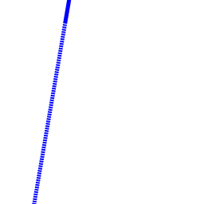
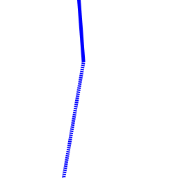
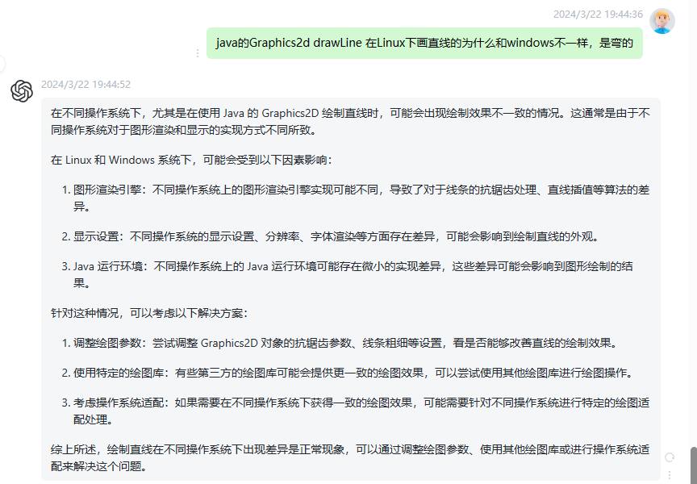
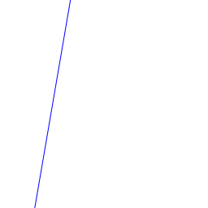

同一份java代码，在windows平台和linux平台运行结果竟然不一样，到底怎么回事！！！
<!--truncate-->

### 背景
在某个下午，组内的开发接到一个需求，需要用java生成图片，是一个很简单的需求，所以开发很快就写出来了。然后在本地windows环境调试也没问题，于是就把代码换上了我们的测试环境。

一套动作行云流水，然后开始测试。

万万没想到啊，本地正常的代码，在测试环境居然有bug。

不可能啊，没道理啊。

于是开发找到我，问我这是怎么回事。

我开始分析。下面我经过日志调试、数据提取分析简化后的代码。

### 简化后的代码
```java  title='简化的代码' icon='logos:java'
import javax.imageio.ImageIO;
import java.awt.*;
import java.awt.image.BufferedImage;
import java.io.File;
import java.io.IOException;

public class ImageTest {
    public static void main(String[] args) throws IOException {
        BufferedImage bi = new BufferedImage(256, 256, BufferedImage.TYPE_INT_ARGB);
        Graphics2D g2d = bi.createGraphics();
        // highlight-start
        BasicStroke dash = new BasicStroke(5, BasicStroke.CAP_BUTT, BasicStroke.JOIN_MITER, 3.5f,
                new float[]{2, 1}, 0f);
        g2d.setStroke(dash);
        // highlight-end
        g2d.setColor(Color.BLUE);
        // 设置抗锯齿
        g2d.setRenderingHint(RenderingHints.KEY_ANTIALIASING, RenderingHints.VALUE_ANTIALIAS_ON);
        g2d.drawLine(-39049, 228094, 105, -110);
        ImageIO.write(bi, "png", new File("/home/ressss.png"));
    }
}
```

代码很简单，就是用java的 Graphics2D画一条直线。**只是直线的端点数字比较大**。

### 不同的结果
windows下通过IDEA运行。linux下用javac编译，java运行。

windows下的输出结果



linux下的输出结果，一条直线，居然会化成弯的！！



### 分析
经过多次测试发现，当线段的两个端点数字较小时，linux下可以输出正常的结果。当数字较大时，输出结果就有问题。

询问GPT，得到如下结果：


java在不同平台的绘图算法不一样，gpt也提到抗锯齿和线条的粗细参数，这都有可能是造成bug的原因。


经过调试，发现不设置抗锯齿，也会出现线段弯曲，而且直线变得很粗糙。

当不设置 Graphics2D 的 stroke时，也就是去掉上面代码的高亮部分，可以得到正常结果。


也就是说，问题出在 BasicStroke 上面。难道使用BasicStroke的方式不对？

修改上面代码，把设置线条轮廓改成
`g2d.setStroke(new BasicStroke(5));`

也得到正常结果：


原来是后面的参数，线段样式的原因。

### 总结
后续了解到，该开发人员在我们代码中发现了有一个地方用到了设置 BasicStroke 线段样式的代码，于是直接拿过来用了，没想到出现这个问题。

我看了原来用到 BasicStroke 的地方，发现那个功能是用户要求使用丰富的线段样式，实线、虚线、线宽等不同线样式。所以这个地方用了这种详细的 BasicStroke参数。原来的需求也不会出现这种数据差异较大的情况，所以一直没有出现今天这种bug。

而新需求并不需要复杂的线段样式，只需要设置线宽就可以了。但该开发直接把这个代码搬过来，从而造成这个bug。

BasicStroke样式还是比较发杂。

所以还是不能盲目照搬，需要理解代码、理解需求、灵活运用，从而减少bug。

最后，还是没有搞懂，为啥linux下设置这种样式的线会出现这种奇怪的bug呢？等有时间了再好好分析吧。