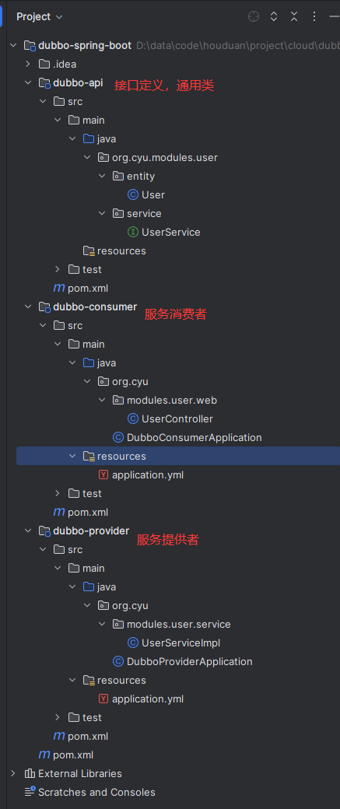
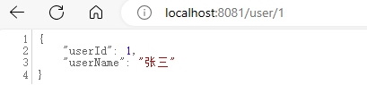
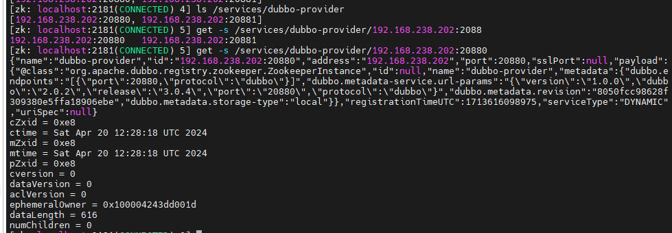
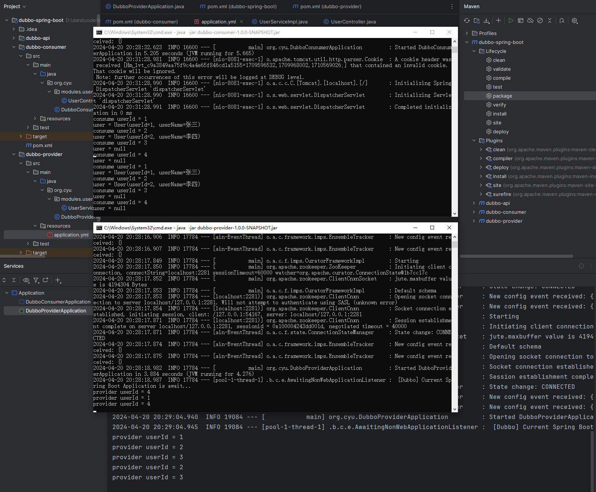

SpringBoot整合Dubbo3.0基础配置Demo，使用zk做注册中心， 一个简单的demo， 可以直接拿来复用。
<!--truncate-->
### 概览
Dubbo是阿里巴巴公司开源的一个高性能优秀的服务框架，使得应用可通过高性能的 RPC 实现服务的输出和输入功能，可以和Spring框架无缝集成。
Dubbo是一款高性能、轻量级的开源Java RPC框架，它提供了三大核心能力：面向接口的远程方法调用，智能容错和负载均衡，以及服务自动注册和发现。

之前已经记录过zookeeper的安装使用，本文不再记录如何安装使用zookeeper。  
[zookeeper的基本使用](/2024/04-01-zookeeper的基本使用.md)


本demo项目采用父子模块结构，解决了SpringBoot项目父子模块依赖的问题，可作为其他类似结构项目的参考。我们本着依赖最小化原则，不需要的依赖我们不引入。本demo项目dubbo配置属性只是基础配置，如需更多功能配置，请自行扩展。

最后的demo如下：


### 1. 父工程
创建一个maven项目，pom.xml内容如
```xml  title='pom.xml' icon='logos:xml'
<?xml version="1.0" encoding="UTF-8"?>
<project xmlns="http://maven.apache.org/POM/4.0.0"
         xmlns:xsi="http://www.w3.org/2001/XMLSchema-instance"
         xsi:schemaLocation="http://maven.apache.org/POM/4.0.0 http://maven.apache.org/xsd/maven-4.0.0.xsd">
    <modelVersion>4.0.0</modelVersion>
    <parent>
        <groupId>org.springframework.boot</groupId>
        <artifactId>spring-boot-starter-parent</artifactId>
        <version>2.7.12</version>
        <relativePath/>
    </parent>

    <groupId>org.example</groupId>
    <artifactId>dubbo-spring-boot</artifactId>
    <version>1.0-SNAPSHOT</version>
    <packaging>pom</packaging>

    <modules>
        <module>dubbo-api</module>
        <module>dubbo-provider</module>
        <module>dubbo-consumer</module>
    </modules>

    <properties>
        <maven.compiler.source>8</maven.compiler.source>
        <maven.compiler.target>8</maven.compiler.target>
        <project.build.sourceEncoding>UTF-8</project.build.sourceEncoding>
        <dubbo-boot.version>3.0.4</dubbo-boot.version>
        <zkclient.version>4.2.0</zkclient.version>
    </properties>

    <dependencyManagement>
        <dependencies>
            <!-- apache 官方 3.0 starter依赖 -->
            <dependency>
                <groupId>org.apache.dubbo</groupId>
                <artifactId>dubbo-spring-boot-starter</artifactId>
                <version>${dubbo-boot.version}</version>
            </dependency>

            <!-- zookeeper客户端  只需引入此依赖curator-framework curator-recipes 都有 -->
            <dependency>
                <groupId>org.apache.curator</groupId>
                <artifactId>curator-x-discovery</artifactId>
                <version>${zkclient.version}</version>
            </dependency>
        </dependencies>
    </dependencyManagement>

    <build>
        <plugins>
            <plugin>
                <groupId>org.apache.maven.plugins</groupId>
                <artifactId>maven-compiler-plugin</artifactId>
                <configuration>
                    <source>1.8</source>
                    <target>1.8</target>
                    <encoding>UTF-8</encoding>
                </configuration>
            </plugin>
            <plugin>
                <groupId>org.apache.maven.plugins</groupId>
                <artifactId>maven-surefire-plugin</artifactId>
                <configuration>
                    <skipTests>true</skipTests>
                </configuration>
            </plugin>
        </plugins>
    </build>
</project>
```

### 2. api模块
api 模块用来管理暴露的接口和实体类。在父模块下新建Module，直接选择maven方式创建。

pom只有一个lombok，可以根据需要引入其他依赖。

```xml  title='pom.xml' icon='logos:xml'
<?xml version="1.0" encoding="UTF-8"?>
<project xmlns="http://maven.apache.org/POM/4.0.0"
         xmlns:xsi="http://www.w3.org/2001/XMLSchema-instance"
         xsi:schemaLocation="http://maven.apache.org/POM/4.0.0 http://maven.apache.org/xsd/maven-4.0.0.xsd">
    <modelVersion>4.0.0</modelVersion>
    <parent>
        <groupId>org.example</groupId>
        <artifactId>dubbo-spring-boot</artifactId>
        <version>1.0-SNAPSHOT</version>
    </parent>

    <artifactId>dubbo-api</artifactId>

    <dependencies>
        <dependency>
            <groupId>org.projectlombok</groupId>
            <artifactId>lombok</artifactId>
            <scope>provided</scope>
        </dependency>
    </dependencies>

</project>
```

User实体类
```java  title='User.java' icon='logos:java'
package org.cyu.modules.user.entity;

import lombok.AllArgsConstructor;
import lombok.Data;
import lombok.NoArgsConstructor;

import java.io.Serializable;

@Data
@NoArgsConstructor
@AllArgsConstructor
public class User implements Serializable {

    private static final long serialVersionUID = 8728327146677888239L;

    private Integer userId;

    private String  userName;
}
```

UserService接口类
```java  title='UserService.java' icon='logos:java'
package org.cyu.modules.user.service;

import org.cyu.modules.user.entity.User;

public interface UserService {
    User getByUserId(Integer userId);
}
```

### 3. provider模块
provider是服务提供者，向外提供接口。

pom如下

```xml  title='pom.xml' icon='logos:xml'
<project xmlns="http://maven.apache.org/POM/4.0.0" xmlns:xsi="http://www.w3.org/2001/XMLSchema-instance"
         xsi:schemaLocation="http://maven.apache.org/POM/4.0.0 http://maven.apache.org/xsd/maven-4.0.0.xsd">
    <modelVersion>4.0.0</modelVersion>
    <parent>
        <groupId>org.example</groupId>
        <artifactId>dubbo-spring-boot</artifactId>
        <version>1.0-SNAPSHOT</version>
    </parent>

    <artifactId>dubbo-provider</artifactId>
    <version>1.0.0-SNAPSHOT</version>

    <name>dubbo-provider</name>
    <url>http://maven.apache.org</url>

    <dependencies>
        <!-- 不是web工程 只需引入这个即可 -->
        <dependency>
            <groupId>org.springframework.boot</groupId>
            <artifactId>spring-boot-starter</artifactId>
        </dependency>

        <dependency>
            <groupId>org.apache.dubbo</groupId>
            <artifactId>dubbo-spring-boot-starter</artifactId>
        </dependency>

        <dependency>
            <groupId>org.apache.curator</groupId>
            <artifactId>curator-x-discovery</artifactId>
        </dependency>

        <dependency>
            <groupId>org.example</groupId>
            <artifactId>dubbo-api</artifactId>
            <version>1.0.0-SNAPSHOT</version>
        </dependency>

        <dependency>
            <groupId>org.springframework.boot</groupId>
            <artifactId>spring-boot-starter-test</artifactId>
            <scope>test</scope>
        </dependency>
    </dependencies>

    <build>
        <plugins>
            <plugin>
                <groupId>org.springframework.boot</groupId>
                <artifactId>spring-boot-maven-plugin</artifactId>
                <version>2.7.12</version>
            </plugin>
        </plugins>
    </build>
</project>
```

配置文件
```yml  title='application.yml' icon='logos:yml'
# 这里的配置属性只是基础配置，如需更多功能配置，请自行扩展
dubbo:
  application:
    name: dubbo-provider
  registry:
    address: zookeeper://localhost:2281
  protocol:
    name: dubbo
    port: 20880
```


UserServiceImpl接口实现类
```java  title='UserServiceImpl.java' icon='logos:java'
package org.cyu.modules.user.service;

import org.apache.dubbo.config.annotation.DubboService;
import org.cyu.modules.user.entity.User;

import java.util.Arrays;
import java.util.List;

/**
 * 3.0x后dubbo @Service 为了和 spring的 @Service区分，改为了 @DubboService，相应的 @Reference
 * 也改为了 @DubboReference
 */
@DubboService
public class UserServiceImpl implements UserService {

    // 模拟数据
    private static final List<User> USERS = Arrays.asList(
            new User(1, "张三"),
            new User(2, "李四")
    );

    @Override
    public User getByUserId(Integer userId) {
        System.out.println("provider userId = " + userId);
        for (User user : USERS) {
            if (user.getUserId().equals(userId)) {
                return user;
            }
        }
        return null;
    }
}
```

为了provider工程能运行，我们需添加启动类 DubboProviderApplication.java
```java  title='DubboProviderApplication.java' icon='logos:java'
package org.cyu;

import org.apache.dubbo.config.spring.context.annotation.EnableDubbo;
import org.springframework.boot.SpringApplication;
import org.springframework.boot.autoconfigure.SpringBootApplication;

@EnableDubbo
@SpringBootApplication
public class DubboProviderApplication {

    public static void main(String[] args) {
        SpringApplication.run(DubboProviderApplication.class, args);
    }
}
```


### 4. consumer模块
consumer是服务消费者，可以请求提供者暴漏的接口。

pom如下

```xml  title='pom.xml' icon='logos:xml'
<project xmlns="http://maven.apache.org/POM/4.0.0" xmlns:xsi="http://www.w3.org/2001/XMLSchema-instance"
         xsi:schemaLocation="http://maven.apache.org/POM/4.0.0 http://maven.apache.org/xsd/maven-4.0.0.xsd">
    <modelVersion>4.0.0</modelVersion>
    <parent>
        <groupId>org.example</groupId>
        <artifactId>dubbo-spring-boot</artifactId>
        <version>1.0-SNAPSHOT</version>
    </parent>

    <artifactId>dubbo-consumer</artifactId>
    <version>1.0.0-SNAPSHOT</version>

    <name>dubbo-consumer</name>
    <url>http://maven.apache.org</url>

    <dependencies>
        <dependency>
            <groupId>org.springframework.boot</groupId>
            <artifactId>spring-boot-starter-web</artifactId>
        </dependency>

        <dependency>
            <groupId>org.apache.dubbo</groupId>
            <artifactId>dubbo-spring-boot-starter</artifactId>
        </dependency>

        <dependency>
            <groupId>org.apache.curator</groupId>
            <artifactId>curator-x-discovery</artifactId>
        </dependency>

        <dependency>
            <groupId>org.example</groupId>
            <artifactId>dubbo-api</artifactId>
            <version>1.0.0-SNAPSHOT</version>
        </dependency>

        <dependency>
            <groupId>org.springframework.boot</groupId>
            <artifactId>spring-boot-starter-test</artifactId>
            <scope>test</scope>
        </dependency>
    </dependencies>

    <build>
        <plugins>
            <plugin>
                <groupId>org.springframework.boot</groupId>
                <artifactId>spring-boot-maven-plugin</artifactId>
                <version>2.7.12</version>
            </plugin>
        </plugins>
    </build>
</project>
```

配置文件
```yml  title='application.yml' icon='logos:yml'
dubbo:
  application:
    name: dubbo-consumer
  registry:
    address: zookeeper://localhost:2281
  protocol:
    name: dubbo
    port: 20880

# 由于zookeeper启动时要占用8080端口，我们要显示指定端口，要不然会端口冲突
server:
  port: 8081
```


UserController rest接口，调用provider提供的接口。
```java  title='UserController.java' icon='logos:java'
package org.cyu.modules.user.web;

import org.apache.dubbo.config.annotation.DubboReference;
import org.cyu.modules.user.entity.User;
import org.cyu.modules.user.service.UserService;
import org.springframework.http.ResponseEntity;
import org.springframework.web.bind.annotation.GetMapping;
import org.springframework.web.bind.annotation.PathVariable;
import org.springframework.web.bind.annotation.RestController;

@RestController
public class UserController {

    @DubboReference
    private UserService userService;

    @GetMapping("/user/{userId}")
    public ResponseEntity<User> getByUserId(@PathVariable("userId") Integer userId) {
        System.out.println("consume userId = " + userId);
        User user = userService.getByUserId(userId);
        System.out.println("user = " + user);
        return ResponseEntity.ok(user);
    }
}
```

为了消费者工程能运行，我们需添加启动类 DubboConsumerApplication.java
```java  title='DubboConsumerApplication.java' icon='logos:java'
package org.cyu;

import org.springframework.boot.SpringApplication;
import org.springframework.boot.autoconfigure.SpringBootApplication;

@SpringBootApplication
public class DubboConsumerApplication {

    public static void main(String[] args) {
        SpringApplication.run(DubboConsumerApplication.class, args);
    }
}
```

### 5. 测试结果
分别启动provider、consumer后，调用接口。



可以启动多个provider，然后去zookeeper中查看dubbo的注册信息。


多请求几次接口，然后看到如下结果：


可以看到dubbo的默认负载均衡策略不是轮询，而是Random LoadBalance（随机负载均衡）。  
当 Dubbo 服务提供者有多个实例时，Random LoadBalance 会随机选择一个实例来处理服务请求。在使用 Random LoadBalance 策略时，每个服务消费者调用的实例都可能不同，因此负载均衡效果较为平均。

dubbo的负载均衡主要有Random（随机，这种是默认的负载均衡策略）、RoundRobin （轮询）、LeastActive （最少活跃数）、ConsistentHash（一致性hash）可以在暴露服务的时候使用loadbalance进行指定。
- **随机**：在一个截面上碰撞的概率高，调用量越大分布越均匀，而且按概率使用权重后也比较均匀，有利于动态调整提供者权重。
- **轮询**：存在慢的提供者累积请求的问题，一台机器很慢，但没挂，当请求轮询到那台机子就卡在那，久而久之，所有请求都卡在那台服务器上。
- **最少活跃数**：使慢的提供者收到更少请求，因为越慢的提供者的调用前后计数差会越大。
- **一致性hash**：当某一台提供者挂时，原本发往该提供者的请求，基于虚拟节点，平摊到其它提供者，不会引起剧烈变动。可以方便节点的增加及移除。

### 源码
[dubbo-spring-boot.zip](https://gitee.com/yuchee/Alittle/raw/master/share/zip/dubbo-spring-boot.zip "下载")