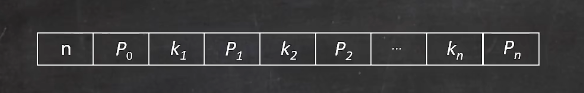
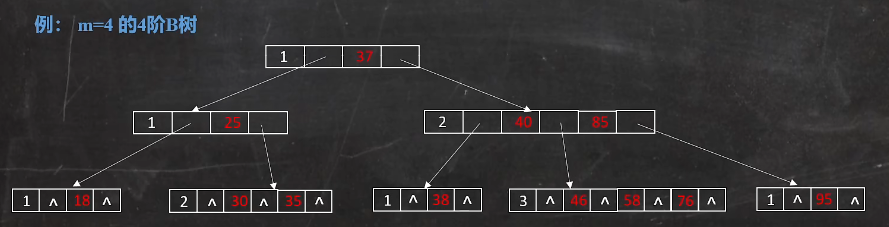
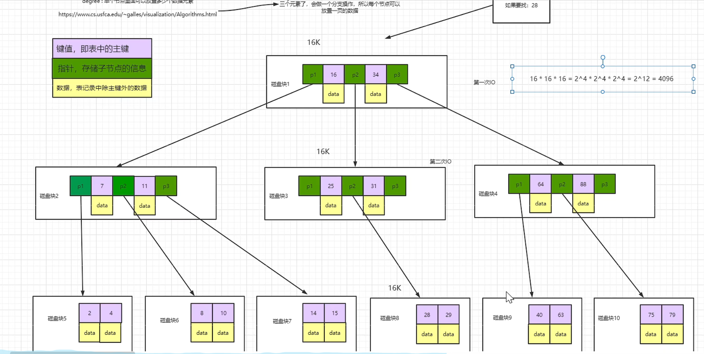
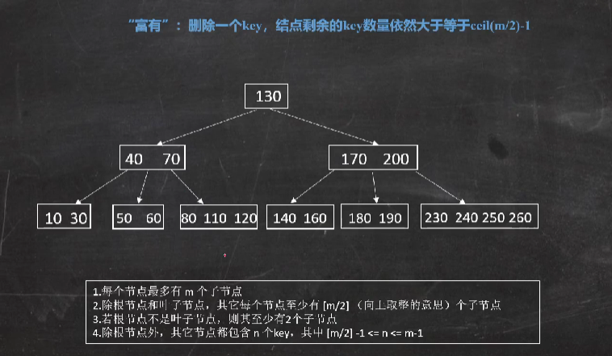
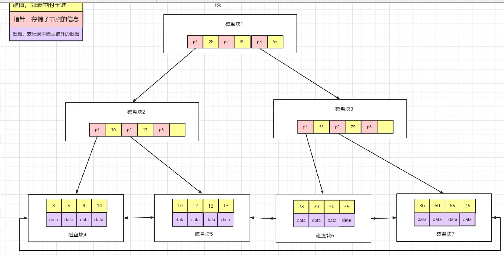

这个问题比较复杂，还在学习总结中。

[演示数据结构网址](https://www.cs.usfca.edu/~galles/visualization/Algorithms.html "演示数据结构网址")  
[B站讲解](https://www.bilibili.com/video/BV1mY4y1W7pS "B站讲解")

### 1. 树的进化
B树又称B-树，其实是误解，没有B-树。（B-Tree）

前置，从磁盘查找数据效率低，一是读写数据量大，二是读写次数多，导致效率低。

索引为什么可以提高查找速度？参考字典

用什么数据结构快呢？

**线性结构**，查找需要遍历比较慢，如果涉及插入删除，要移动元素，就更慢了。

**哈希结构**，一般很快，但是元素很多时，就会产生哈希冲突，数据散列不均匀，产生大量线性查询，效率低。
遇到范围查询，得挨个遍历，哈希就不合适了。

树结构，有很多类型，需单独学习。  
**二叉树**，最简单的树，数据结构中学过。

**二叉排序树**，BST。左子树的结点的值都小于根结点的值，右子树的结点的值都大于根结点的值。查找效率高，O(logn)。  
如果插入的值是顺序的，会退化成一个线性结构，最坏结果。

**平衡二叉树**，AVG。为了解决二叉排序树的缺点，插入数据的时候要保持二叉排序树的平衡，左子树和右子树的高度之差的绝对值不大于1。这样就避免了变成线性结构。  
用插入的成本来弥补查询的效率。一旦出现插入操作多于查询操作的情况下，平衡二叉树也就不适合了。开销很大。

**红黑树**，在AVG的基础上，加上最长子树不超过最短子树的2倍。目的是不让插入做大量的旋转，解决平衡二叉树的缺点。还有很多特点，java8 的 hashmap 中也有涉及。
- 根结点是黑色。
- 每个红色结点的两个子结点都是黑色。从每个叶子结点到根的所有路径上不能有两个连续的红色结点。
- 从任一个结点到其每个叶子结点的所有路径都包含相同数目的黑色结点。

口诀：左根右，根叶黑，不红红，黑路同。  
数据量大时，树的深度很高，效率就低了。  
二叉树的局限性导致的。所以多叉树开始出现。

**B树**就是一个有序的多路查询树。MongoDB  
定义：满足下列要求的m叉树：
- 每个结点最多有m个孩子结点(最多有m-1个关键字)。以手为例，手指代表5个子结点，手掌代表根结点，手指间的缝隙代表指针或者叫关键字。
- 结点的结构为
    
    n代表 结点有多少个关键字。  
    P表示指针，找到子树。  
    K表示关键字，间隔。  
    
    最大关键字为3，所以是4阶B树。  
    可以发现是有序的，左边的都比根结点小，右边的都比根结点大。
- 除根结点外，其他结点最少有 m/2 个孩子结点。（向上取整）
- 如果根结点不是叶子结点，则根结点最少有两个孩子结点。
- 所有叶子结点都在同一层上，即B树是所有结点的平衡因子均等于0的多路查找树。
- 除了根结点，其他结点都包含n个key，其中 `m/2 -1 <= n <= m-1`。key表示结点中的数据。

  
B树的缺点

如果用B树存数据，每个结点用16K存16条数据，那么3层可以存 16x16x16 = 4096 条数据，这还是没有算指针等占用的空间的数据量，所以就太浪费空间了。如果要存更多数据，就要加树的层数，那么就会越加越多，效率也会越来越低（每一层表示一次磁盘IO）。  
数据和关键字、指针在同一个结点上的缺点。**B+树**对此进行了优化，非叶子结点只存索引（键信息），叶子结点只存数据，可以存更多数据，效率就上来了（不要那么多层）。
  
B树的删除

删除一个key，结点剩余的key数量仍然大于ceil(m/2)-1，可以直接删除。  
兄弟不够借，把父节点拉到左边兄弟，然后跟左边兄弟合并，正好凑m-1个最大的节点。

### 2. B树和B+树的区别，为什么Mysql使用B+树存储索引
B树的特点
- 结点有序
- 一个结点可以存多个元素，多个元素也排序了
- 数据和指针在同一结点上

B+树的特点
- 拥有B树的特点
- 叶子结点之间有指针
- 非叶子结点不保存数据，叶子结点只存数据。这样非叶子节点保存的关键字比B树多，所以树的高度低，存的数据多。

Mysql索引使用B+树，因为B+树的特点通过对数据进行了排序提高了查询速度。一个叶子结点可以存储多个元素，从而使得B+树的高度不会太高。在Mysql中一个Innodb叶就是一个B+树节点，默认为16kb，所以一般情况下一颗两层的B+树可以存2000w行左右的数据。通过利用B+树叶子结点存储了所有数据并且排序，并且叶子结点之间有指针，可以很好的支持全表扫描，范围查找等SQL语句。

