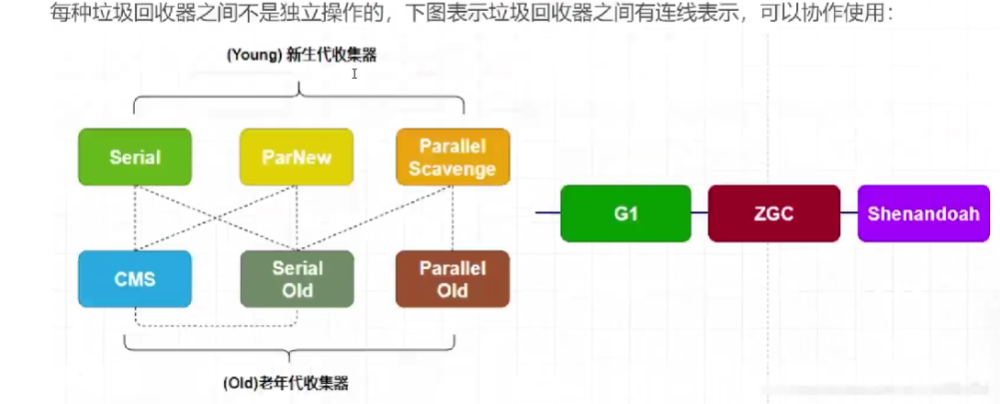

### 常见的垃圾回收器
**新生代(高吞吐量)**：Serial,ParNew, Parallel Scavenge   
**老年代(SWT停顿时间)**: Serial Old, CMS, Parallel Old     
**新生代和老年代皆可**: G1, ZGC, Shenandoah

### 常见搭配
JDK5之前
- Serial（复制算法，单线程） + Serial Old（标记整理，单线程）

JDK8之后 
- ParNew（复制算法，并行）+ CMS（标记清除，并行）：适合需要低停顿时间的应用，如Web服务器、应用服务器(电商、在线游戏、高并发)。4-8G可以用这种。
- Parallel Scavenge（复制算法，并行，吞吐量优先）+ Parallel Old（标记整理，并行）: 适合多核处理器高吞吐量应用。(科学计算，数据分析，大规模数据处理)
- G1（年轻代：复制，老年代：标记整理），JDK9默认垃圾收集器。尽可能可控GC停顿时间。内存占用较大的应用:适合需要可预测停顿时间的应用，尤其是大堆内存的应用。(企业级应用、中大规模Web服务、应用响应要求高的系统)。内存8G以上可以用这种。
- ZGC适合需要极低停顿时间(毫秒级别)的大内存应用。内存密集型数据库，金融交易系统，云服务。几百G以上的内存。
